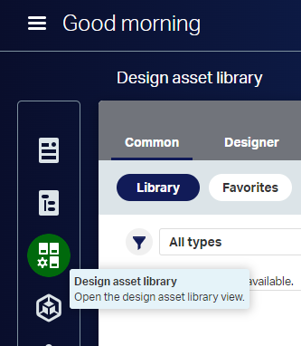
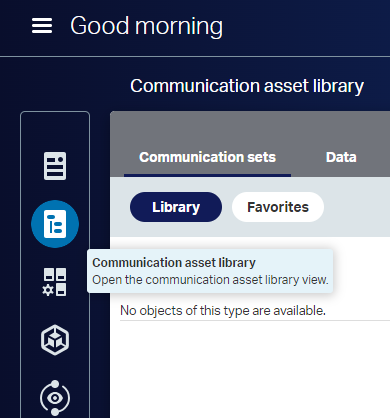
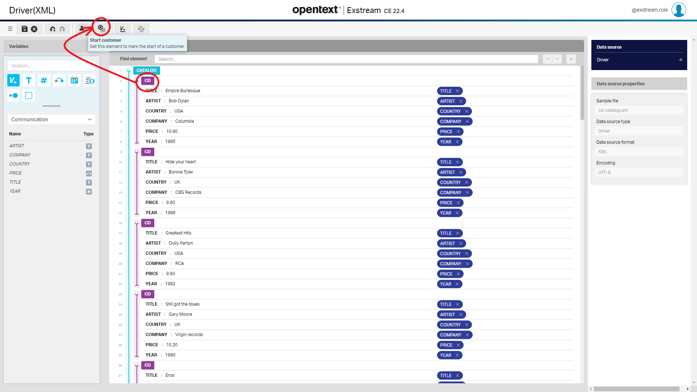
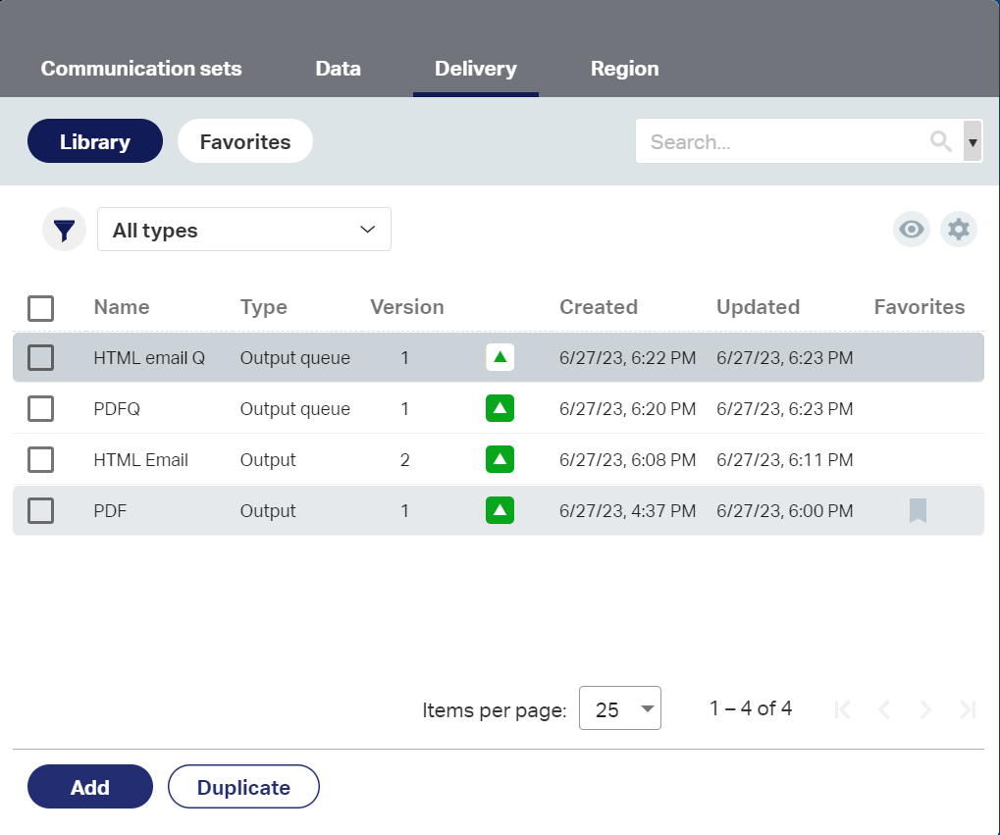

In this article, we are going to describe how to create a basic communication completely from scratch. 
We'll create the mythical Hello World! with **Exstream**.

> OpenText™ Exstream™ is a Customer Communications Management (CCM) software platform for creating ultra-personalized 
> content delivered anytime, anywhere!
>
> OpenText™ Exstream™ gives organizations one secure, cost-effective, efficient and reliable solution for all 
> customer communications. Part of the OpenText™ Experience Platform, Exstream is a CCM tool that scales to fit 
> the customer engagement needs of any department or complex enterprise environment and speeds key business 
> processes with accelerator packages offering easy integration with core systems.

You just need to follow the steps described in the coming sections.


## Creating a Domain

 A **domain** in a tenant is simply a logical grouping of resources in the DAS asset library. By default, when you add or create a resource, it is associated with the domain in which it is created. 

Follow these steps to create a new domain:

 - Access to `Design`, i.e.  https://MY_EXSTREAM_SERVER/design/index.html
 
 

 - Click on `Tenant Managment` icon
 
 
 
 - Click on `Domains` tab
 - Click on `Add` button
 - On the **Properties** panel:
    - Provide a domain `Name`, i.e. *hello-world*
	- Click on `Save` button
	
	

	- Clic on `Group assigments` tab
	- Clic on `Add group assigments (+)` button
	- Select a *partition*, i.e. `exstream.role`
	
	
	
	- Select the groups of your choice
	- Asign one or more roles to each group
	
		
	
	- Click on `Apply` button
	
### Configuring the domain to use the simple workflow

You can configure one or more domains in a tenant to use the **simple workflow** instead of the standard workflow. 
**The simple workflow skips the Submitted for approval state**. In a domain with simple workflow, if your user role
can approve resources that are associated with the domain, you can approve those resources in one step.	

 - Clic on `workflow` tab
 - Select **Simple** on the `Workflow type` drop-down list
	
 

 - Click on `Save`button
	
	
	
## Content Author & Communicatios Designer

Now that we have created a domain and assigned permissions to groups we must click on `Current domain` on the top-right-hand side and select our domain, *hello-world*.
 
 	
 
 We will see two clients:
 
 - **Communications Designer** lets designers use resources that are set up either in Design Manager or the DAS asset library to create and customize new communications.
 - **Content Author** lets business users add targeted content to communication designs that are created in Design and Production or in Communications Designer.
 
 
### Design asset library


#### Design asset library - File Sample

To provide a convenient way to preview communications with different variable values, the Exstream web client supports uploading **sample files** for use with *Communications Designer* and *Content Author*. This functionality is especially useful when previewing a communication that might change when the sample customer data changes, such as when regulations in a particular state require additional content to be included in a communication.

Keep in mind that sample files are not used in engine orchestration jobs; they are used only to map data sources, generate previews for Content Author, and generate simulations for Communications Designer and Content Author.

To add a sample file: 

 - Click on `Design asset library` on the left-hand-side menu
 
 	

 - Click on `Common` tab
 - Click on `Add` button
 - Select `Sample file` option from the drop-down list
 
 	
 
 - Choose a XML with your data. In our example we'll use a XML file called *cd-catalog.xml* that looks like this:
 
 
```xml 
 
	<?xml version="1.0" encoding="UTF-8"?>
	<CATALOG>
	  <CD>
		<TITLE>Empire Burlesque</TITLE>
		<ARTIST>Bob Dylan</ARTIST>
		<COUNTRY>USA</COUNTRY>
		<COMPANY>Columbia</COMPANY>
		<PRICE>10.90</PRICE>
		<YEAR>1985</YEAR>
	  </CD>
	  
	  ...
	  
	  <CD>
		<TITLE>Unchain my heart</TITLE>
		<ARTIST>Joe Cocker</ARTIST>
		<COUNTRY>USA</COUNTRY>
		<COMPANY>EMI</COMPANY>
		<PRICE>8.20</PRICE>
		<YEAR>1987</YEAR>
	  </CD>
	</CATALOG>  
	
```

The sample file is loaded. Let's approve it to make it available for its use.
 
 	
 
 - Click on the `Approve icon`
 
 	 
 
 - Click on the `Approve`

 
### Communication asset library

#### Data source

A **data source** is what *Communications Designer* uses to identify which sample file to use for a particular data map. 
The same sample file can be used in multiple data sources, and be mapped differently for each data source with which is it associated.

When a data source is assigned to a communication, any variables mapped in the data source become available for use in the communication.

Use the Communication asset library view to create and modify the data sources that can be used when fulfilling your communications.
 
Follow these steps to add a new data source:
 
 - Click on `Communication asset library` on the left-hand-side menu
 
  	

 - Click on `Data` tab
 - Click on `Add` button
 - Select `Data source` on the drop-down list
 - Provide the required information
    - **Name**: Driver
	- **Data source format**: XML
	- **Sample file**: cd-catalog.xml
	- **Production data source name**: cd-catalog.xml
 
 	 
 
  - Click on `Create` button
 
 Let's see the data source that we have created.
 
  - Click on `Create` button
  
 	 

- Click on the `Automap` button on the top menu

 	  
 

> Automapping a data source lets you automatically find and map all of the data areas in a data source. 
> You can use the automapping process to map the data source using new variables that are created as part of 
> the automapping process, or using existing variables. 

##### Marking the start of a new customer

For each data source, you must specify which element starts a new customer. You must identify at least one element as a customer in the data; otherwise, the engine will not process your application.

When you identify a data area as the start of a new customer, the Start of customer designation will propagate to the equivalent data areas within the data file.

Select the data area that you want to use as the start of a new customer.

In the toolbar: 

 - Click the `Start customer` button.

 	  

 - Click on `Save` button.
 - Click on `Close` button to return to the home page.
 
We are back on *Communication asset library* screen, *Data* tab. So, we 

 - Click on `Approve` icon of our data source called *Driver*
 - Click on `Approve` option
 - Click on `Save` button on the `Workflow state change` pop-up
 
####  Communication sets  

A **communication set** is a resource that combines other communication resources into one collection. When you create a communication, you can associate it with a communication set, allowing for greater reuse if you want multiple communications to use the same set of resources. A communication set takes the place of a design pack when creating a *Communications Designer communication*, thus alleviating the need to make resource updates in *Design Manager*.

*Communication sets* can also be used to create communications that are the basis for *Content Author* templates.

Follow these steps to create a *Communication set*:

 - Click on `Communication asset library` option in the left-hand-side menu
 - Click on `Communication sets` tab
 - Click on `Add` button
 - Provide the required information:
    - **Name**: HelloWorld
 - Click on `Save` button
 
 	  
 
#### Delivery  

##### Output

You can use the asset library panel in the *Communication asset library* view to add **outputs objects** to the 
asset library for use with a communication. Output objects are communication assets to which you assign an output driver. 

After you assign an output driver to an output object, you can customize the settings specific to output production.

Follow these steps to create an *Ouput*:

 - Click on `Communication asset library` option in the left-hand-side menu
 - Click on `Delivery` tab
 - Click on `Add` button
 - Click on `Output` option
 - In the `Create new output` section:
    - Provide required information:
	   - **Name**: PDF
	   - **Output type**: PDF
    - Click on `Save` button
  - In the `General` tab, select `PDF/UA` as **Accessibility standard** and click on `Save` button
  - Click on `Approve` icon of our *output* called  *PDF*
  
  	  
 
  - Click on `Approve` option
  
  	  
  
  - Click on `Change` button on the `Workflow state change` pop-up
  
We´ll generate a second output following the previous steps, just changing these values:

 - **name**: HTML email
 - **Output Type**: HTML email
 - **Accessibility standard**: GCAG 2.0
 - **Aligment**: Center
 
##### Output Queue

You can use the asset library panel in the *Communication asset library* view to add output queue objects to 
the asset library for use with a communication. **Output queues** function as containers for production settings, 
including those for output drivers.

You can add multiple output queues to a communication set to produce output with a variety of high-volume 
settings and output driver settings, including a mix of print and electronic drivers, while running the 
engine only once in Exstream. When a communication set has multiple output queues, you can designate one 
to be the primary queue. 
  
Follow these steps to create an *Ouput queue*:

 - Click on `Communication asset library` option in the left-hand-side menu
 - Click on `Delivery` tab
 - Click on `Add` button
 - Click on `Output Queue` option
 - In the `Create new output queue` section:
    - Provide required information:
	   - **Name**: PDFQ
	   - **Output**: PDF
    - Click on `Save` button
  - Click on `Approve` icon of our *output* called  *PDFQ* 
  - Click on `Approve` option  
  - Click on `Change` button on the `Workflow state change` pop-up
  
We´ll generate a second output queue following the previous steps, just changing these values:

 - **name**: HTML email Q
 - **Output**: HTML email

  	  

####  Communication sets (continued) 

 - Click on `Communication asset library` option in the left-hand-side menu
 - Click on `Communication sets` tab
 - Click on `HelloWorld` communication set
 - Click on `Add` button
 - Click on `Output queue` option
 
 	  

 - Click on `Output queue` option
 - On the `Properties` section
    - Click on `HTML email Q` *output queue*
	- Click on `Insert` button
    - Click on `PDFQ` *output queue*
	- Click on `Insert` button
	
 	  

 
 
 
 
 

  