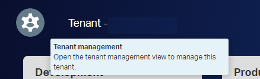
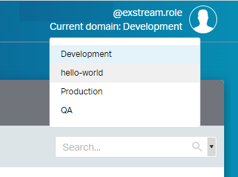

In this article, we are going to describe how to create a basic communication completely from scratch. 
We'll create the mythical Hello World! with **Exstream**.

> OpenText™ Exstream™ is a Customer Communications Management (CCM) software platform for creating ultra-personalized 
> content delivered anytime, anywhere!
>
> OpenText™ Exstream™ gives organizations one secure, cost-effective, efficient and reliable solution for all 
> customer communications. Part of the OpenText™ Experience Platform, Exstream is a CCM tool that scales to fit 
> the customer engagement needs of any department or complex enterprise environment and speeds key business 
> processes with accelerator packages offering easy integration with core systems.

You just need to follow the steps described in the coming sections.


## Creating a Domain

 A **domain** in a tenant is simply a logical grouping of resources in the DAS asset library. By default, when you add or create a resource, it is associated with the domain in which it is created. 

 - Access to `Design`, i.e.  https://MY_EXSTREAM_SERVER/design/index.html
 
 

 - Click on `Tenant Managment` icon
 
 
 
 - Click on `Domains` tab
 - Click on `Add` button
 - On the **Properties** panel:
    - Provide a domain `Name`, i.e. *hello-world*
	- Click on `Save` button
	
	

	- Clic on `Group assigments` tab
	- Clic on `Add group assigments (+)` button
	- Select a *partition*, i.e. `exstream.role`
	
	
	
	- Select the groups of your choice
	- Asign one or more roles to each group
	
		
	
	- Click on `Apply` button
	
### Configuring the domain to use the simple workflow

You can configure one or more domains in a tenant to use the **simple workflow** instead of the standard workflow. 
**The simple workflow skips the Submitted for approval state**. In a domain with simple workflow, if your user role
can approve resources that are associated with the domain, you can approve those resources in one step.	

   - Clic on `workflow` tab
   - Select **Simple** on the `Workflow type` drop-down list
	
   
	
   - Click on `Save`button
	
	
	
## Content Author & Communicatios Designer

Now that we have created a domain and assigned permissions to groups we must click on `Current domain` on the top-right-hand side and select our domain, *hello-world*.
 
 	
 
 We will see two clients:
 
 - **Communicatios Designer** is used to create your template
 - **Content Author** is used to... @TODO
 
### Design asset library

#### Design asset library - File Sample

 - Click on `Design asset library` on the left-hand-side menu
 
 	

 - Click on `Common` tab
 - Click on `Add` button
 - Select `Sample file` option from the drop-down list
 
 	
 
 - Choose a XML with your data. In our example we'll use a XML file called *cd-catalog.xml* that looks like this:
 
 
```xml 
 
	<?xml version="1.0" encoding="UTF-8"?>
	<CATALOG>
	  <CD>
		<TITLE>Empire Burlesque</TITLE>
		<ARTIST>Bob Dylan</ARTIST>
		<COUNTRY>USA</COUNTRY>
		<COMPANY>Columbia</COMPANY>
		<PRICE>10.90</PRICE>
		<YEAR>1985</YEAR>
	  </CD>
	  
	  ...
	  
	  <CD>
		<TITLE>Unchain my heart</TITLE>
		<ARTIST>Joe Cocker</ARTIST>
		<COUNTRY>USA</COUNTRY>
		<COMPANY>EMI</COMPANY>
		<PRICE>8.20</PRICE>
		<YEAR>1987</YEAR>
	  </CD>
	</CATALOG>  
	
```

The sample file is loaded. Let's approve it to make it available for its use.
 
 	
 
 - Click on the `Approve icon`
 
 	 
 
  - Click on the `Submit for approval`
  - In the `Workflow state change` pop-up, click `Change` button

 
 
### Communication asset library
 
 - Click on `Communication asset library` on the left-hand-side menu
 
  	

 - Click on `Data` tab
 