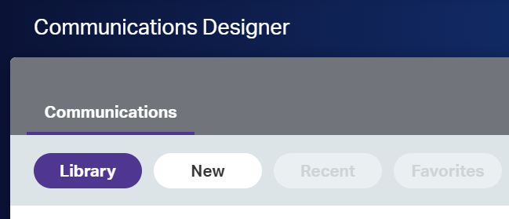

This article is the 2nd part of [Hello World with Exstream](2023-06-26-hello-world-with-exstream.md). It describes how to create a basic communication completely from scratch. 
We'll create the mythical Hello World! with **Exstream**.

> Please, see [Hello World with Exstream (1st Part)](../2023-06-26-hello-world-with-exstream)

You just need to follow the steps described in the coming sections.

## Communicatios Designer

Now that we have all the scaffolding done, let's design a communication. Just follow these steps:
 
 - Click on `Communication launcher` option in the left-hand-side menu
 - Click on `New` button on the `Communications` section

 	  	

 