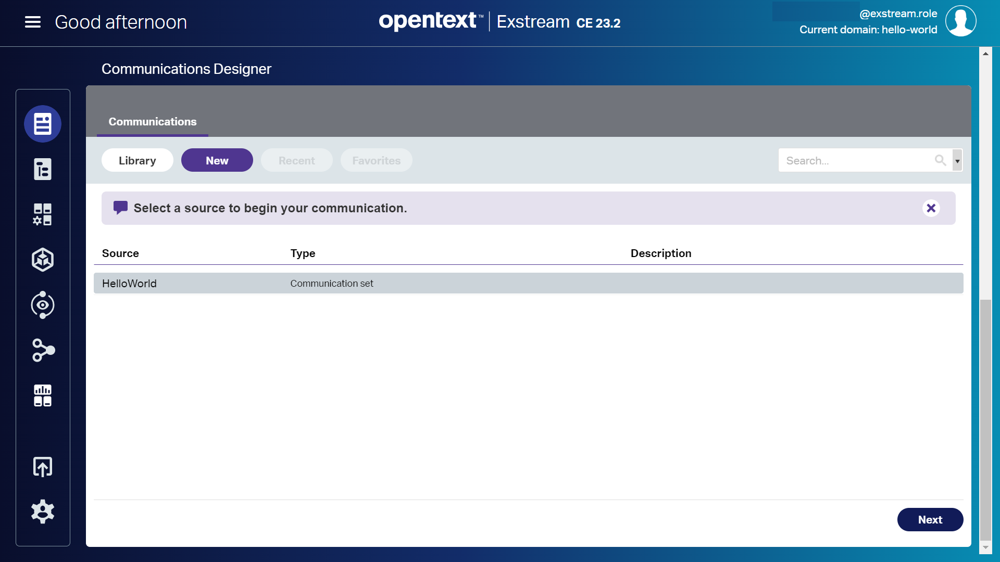
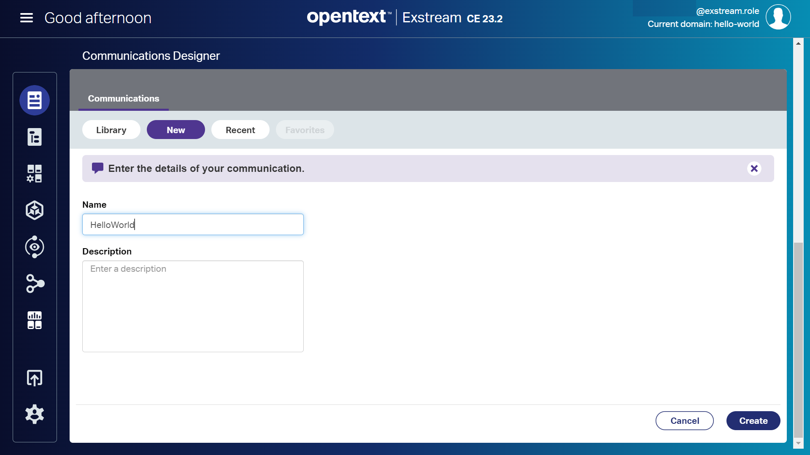
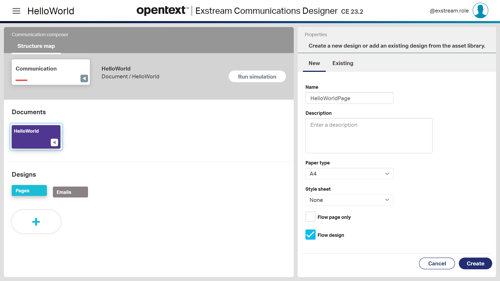
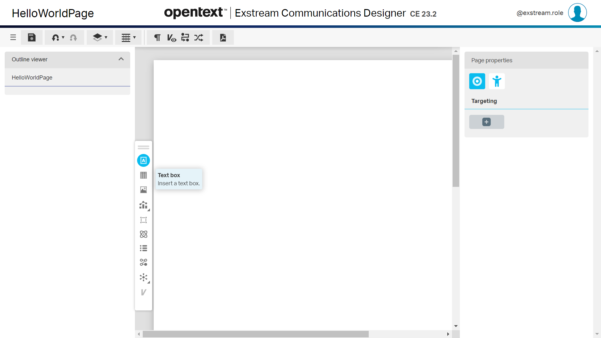
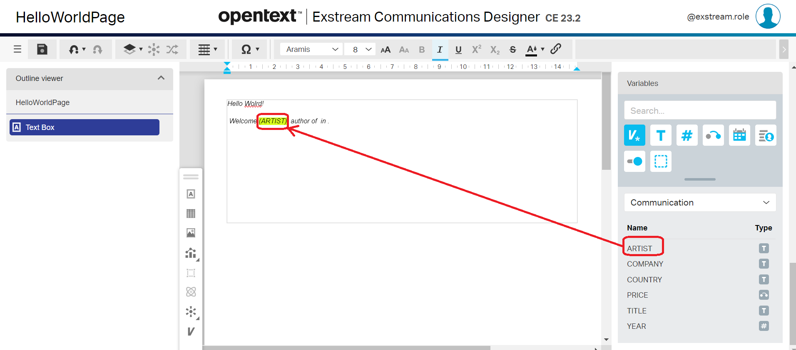

This article is the 2nd part of [Hello World with Exstream](/hello-world-with-exstream). It describes how to create a basic communication completely from scratch. 
We'll create a communication design of the mythical Hello World! with **Exstream**.

> Please, see [Hello World with Exstream (1st Part)](/hello-world-with-exstream)

You just need to follow the steps described in the coming sections.

## Communicatios Designer

Now that we have all the scaffolding done, let's design a communication. Just follow these steps:
 
 - Click on `Communication launcher` option in the left-hand-side menu
 - Click on `New` button on the `Communications` section

 	  	
- Select a `Communication set`. *HelloWorld* in our example.

 	  	
- Click on `Next` button 

 	  	

We must provide the details of our communication:

 - **Name**: HelloWorld
 - **Description**: My First Exstream communication

Now click on `Create` button.
 
A communication can be composed of one or more documents. So, now we are going to add a new document.

 - Click on `(+)` icon
 - Provide the details for your new document
    - **Name**: HelloWorld
    - **Description**: My First Exstream communication (PDF and e-mail)

  
 
 - Click on `Create` button
 
 A couple of designs , **Pages** (pdf) and **Emails** (e-mail), are added automatically due to the two outputs that we have created previously and included in our communications set.
 
 - Click on `Pages`	
 - Click on `(+)` icon
 - Provide the properties for the new desing:
    - **Name**: HelloWorldPage
    - **Paper type**: A4	

  
 
  - Click on `Create` button
 
The design has been created, now we just need to double click on it to open it.
 
   

### Communicatios Designer: Page

An empty page is shown. Now, lets follow these steps to create out first communication, a pdf document:

 - Click on the `Text box` icon

   

 - Use the mouse to define the are where your text box will be placed
 - Click on the text box
 - Write a text, i.e. 'Hello World!'

   
  
 - Click on `Save` button
 - Click on the `hamburger icon` on the left-hand-side
 - Click on `Return to home page`
 
Now we are going to run a simulation to see how looks like our communication. Let's browse to `Communication launcher > Communication Designer`. Once we have selected our communication we must click on the `Run simulation` button
 
    

#### Using variables in our communication (page)

Let's go back to the our communication design. Now we are going to customize a little bit our page, adding a text like this at the end of the page:

```
 Welcome (ARTIST), author of (TITLE) in (YEAR)
```

To do it, we must just follow these instructions:

 - Click on `Variable` icon

    

 - Select the text box
 - Add this text at the ent of the box: "Welcome , author of in ."
 - Place your mouse between "**Welcome**"  and "**,**"
 - Click on `ARTIST` in the *Variable* section in the righ-hand-side

    
   
If you repeat this operation with some of the other available variables your page will look like this:

    

 - Click on `Save` icon

If we go back to the `Communication composer` page we can run a simulation to see how it looks with our example data set. 

    

### Communicatios Designer: Email

Let's go back to our communication called *HelloWorld* in *Communication designer*. Now we'll create a new design for an e-mail. Just:

 - Click on `Documents > HelloWorld`
 - Click on `Design > Emails`
 - Click on `(+)` icon

    

 - Introduce the required information:
    - **Name**: HelloWorldMail
 - Click on `Create` button

Next, let's open the email design by double-clicking on `HelloWorldMail` design

    
   
We can follow the same steps done in the page design, so we can get an email that looks like this:
   
       


Once we have saved our design we can run a simulation to see the final result:

       

> **NOTE**: You need to approve your *Designs*, *Documents* ans Communications to be able to use it.

Congrats, you have created your first communications, one pdf, and one e-mail.