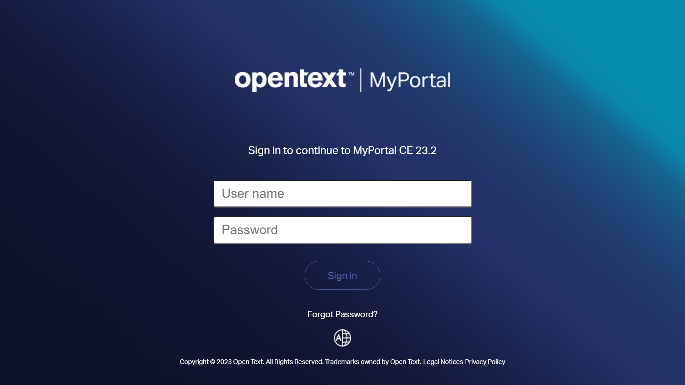
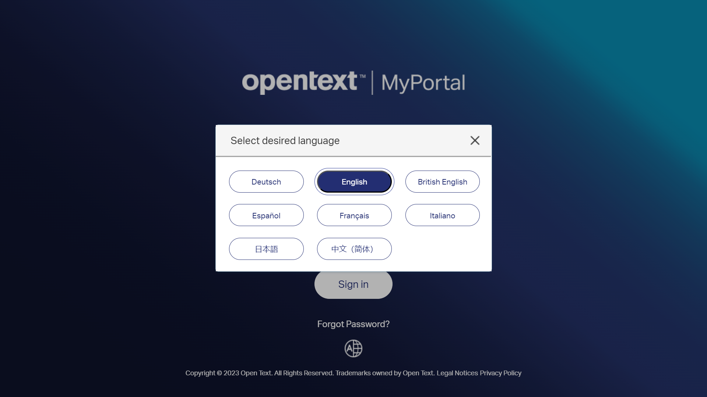
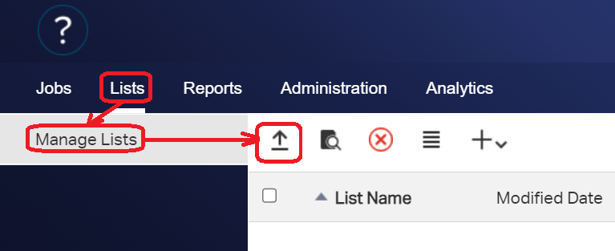
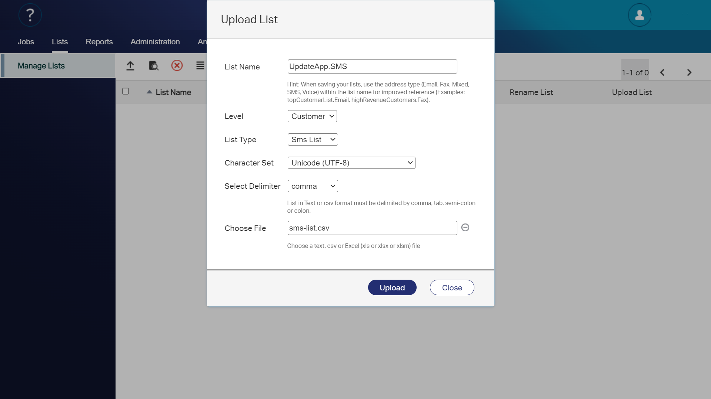
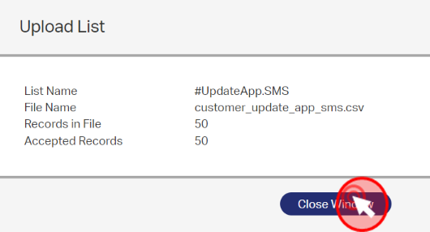

In this article we'll learn how to send SMS with OpenText Notifications.

> OpenText™ Notifications brings email, SMS, push, voice and fax messaging channels together 
> into a single, cloud-based messaging platform, eliminating siloed communication services. 
> Whether sending one or millions of messages, Notifications makes it easy to deliver 
> personalized communications to customers’ channel of choice to strengthen relationships, 
> expand visibility and fuel sales.

## Use case

A new product has been launched, so we want to inform our clients, through SMS, about a special promotion for the early birds. For this, I will use a recipient list and also use variables for personalization. 

## Client list

Our client list is a *CSV* file that looks like this:

```csv
REF,ADDR,INS_1,INS_2,INS_3
Summer campaign 2023,699-999-999,Joaquin,Garzon,joaquin@joaquinonsft.com
```

## Login

Browse to your `Notifications` server and introduce your credentials (user name/password)


 	  	

Click on the `Sign in` button to log in.

### User interface desired language

You can change the language used in the user interface doing click on the `world` icon at the bottom of the login page.

 	
 At the moment of writing this article, there are 8 languages supported by default.

## Upload a client list

Let's create a new client list from our CSV file. 

Click on `Lists > Manage list > Upload list (icon)`
 
 

The `Upload list` pop-up is shown. Just provide the required information:

 - **List name**: UpdateApp.SMS 
 - **Level**: Customer
 - **List type**: Sms List
 - **Character set**: Unicode (UTF-8)
 - **Choose file**: customer-update_app_sms.csv
 
 

Click on `Upload` button to create the list.

When the import is finished, a pop-up window will appear with a summary of the number of imported records. You can close it by clicking the `Close window` button.

 


