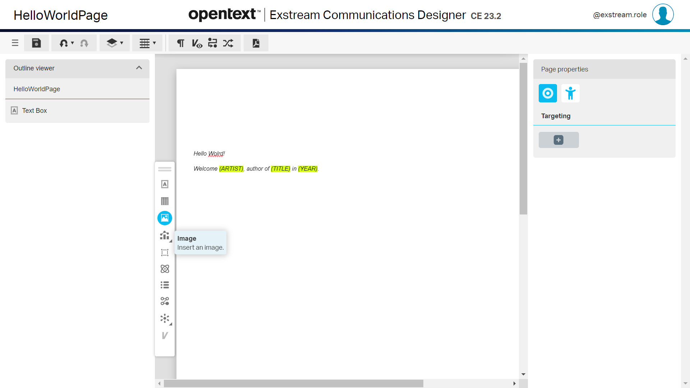
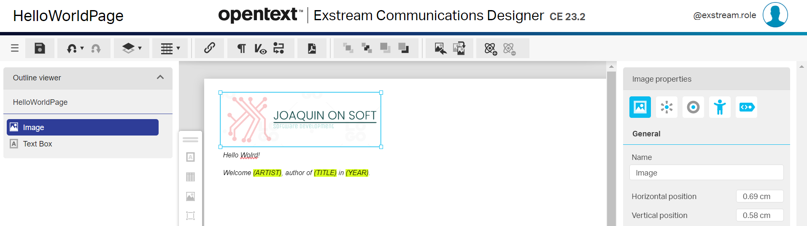
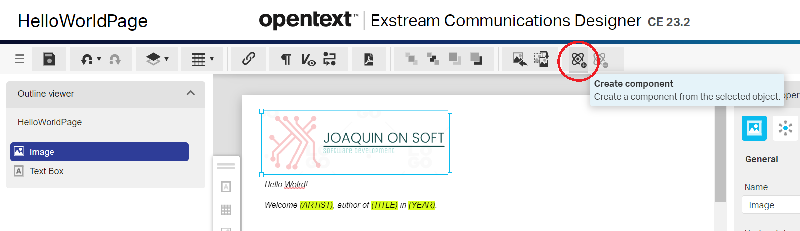

Today I'll explain how to create **my first Exstream reusable component**. 

**Exstream** is an object-oriented platform that  stores all items created in a single central repository. This makes all objects available for sharing and reuse across forms and documents.  

Exstream provides a library of objects, **Components**, that have been saved for reuse in 
other pages, documents, and applications.  Properties (placement and size) of a component 
can be locked so they cannot be changed by other users.  This facilitates not only reuse 
but consistency across documents.  An example is a client address block that is saved for 
use in all correspondence.  When another user wants to include a client’s address they can 
drag and drop the component onto a page. Components can follow the workflow process for 
approval. Comments or metadata can be stored with templates.

> **NOTE**: In this article, I'll assume that you have created a communication using **Exstream**.
> 
> Please, see related articles:
>
> - [Hello World with Exstream (1st Part)](/hello-world-with-exstream)
> - [Hello World with Exstream (2nd Part)](/hello-world-with-exstream-part-2)
>

## Create new component

So, to create our first Exstream reusable component we must follow the following steps:

 - Click on `Communication Launcher` icon in the left-hand side menu 
 - Click on a communication, i.e. *Hello World*, at `Communication Designer`
 
 	  	 
 
 - Click on `Helloworld (Documents) > Pages (Design) > HelloworldPage`

 	 
 
 - Click on `Image` icon on the left-hand side menu
 
 	 
 
 - Select an image from the asset library

 

 - Click on `Insert`
 - Adjust the size and position
 
 
 
 - With the component selected, click on `Create component` icon in the top menu 
 
 

 - Provide the required information at the `Create new component` pop-up:
 
    - **Name**: Logo
    - **Description**: Joaquín On Soft logo
    - **Category tags applied**: type *logo* and click on `Create`	
	
 
	
 - Click on `Create` button	
 
Let's approve our component to make it available to be reused.

 - Click on `Approve` icon on the right-hand side 

  
 
 - Click on `Change` button in the `Workflow state change`
 - Click on `Save` icon in the top menu
 
Let's browse to `Communication composer`:

 - Click on `hamburguer` icon in the top menu
 - Click on `Return to the home page`

  
 
 - Click on `Communication launcher` icon
 - Click on `HelloWorld` *communication* in the `Communication Designer` section
 
A new section, called `Components`, has been added to the `Communication composer` page.

## Reusing our component

Now we are going reuse our `Logo` component in another design.

 - Click on `Helloworld (Documents) > Emails (Design) > HelloworldMail`
 - Select `HEADER` component
 - Click on `Add row below` icon to add a new container

   
 
 - Select the new container
 - Click on `Component` icon in the left-hand menu 

   
 
 - A pop-up called `Select a component from the asset library` is shown
 - Select the component called `Logo` 
 
    
 
 - Click on `Insert` button

   
  
 - Click on `Save` button at the top menu 
 - Click on `Hamburguer` icon in the top left-hand menu
 - Click on `Return to home page` menu item
 
## Approve communications

Last but not least, we must approve the designs and documents modified.

 - Click on `Communication launcher`
 - Click on `HelloWorld` communication at the `Communication designer` section
 - Click on `HelloWord` document

Let's approve the page communication: 

 - Click on `HelloWordPage` design
 - Click on `Approve` icon
 - Select `Approve` menu item
 - Click on `Change` at the `Workflow state change` pop-up
 
Now, let's approve the e-mail communication: 

 - Click on `emails` button at `Designs` section
 - Click on `HelloWordMail` design
 - Click on `Approve` icon
 - Select `Approve` menu item
 - Click on `Change` at the `Workflow state change` pop-up
 
Finally, let's approve the document: 

 - Click on `HelloWordMail` document at the `Documents` section
 - Click on `Approve` icon
 - Select `Approve` menu item
 - Click on `Change` at the `Workflow state change` pop-up