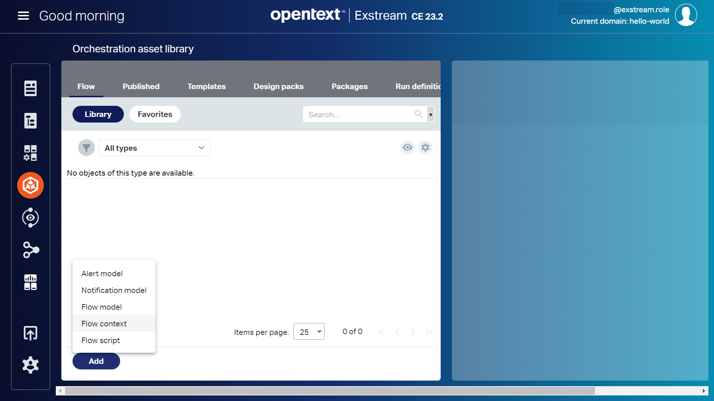
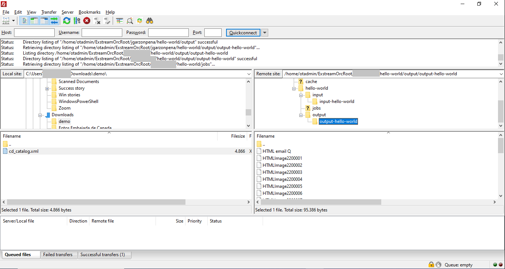

This article is the 3rd part of [Hello World with Exstream](/hello-world-with-exstream). 
It describes how to orchestrate your communication, to produce customer output, with **Exstream**.

## Orchestration

**Orchestration flow models and flow contexts** determine the manner in which engine runs are processed
to produce customer output. Flow scripts can be assigned to flow context items as before and after events, and to script processors.

Now we'll orchestrate our `HelloWorld` communication, created in  [Hello World with Exstream](/hello-world-with-exstream) and [Hello World with Exstream (2nd Part)](/hello-world-with-exstream-part-2) articles.

### Flow context

A **Flow context** contains the input and output channel definitions and the communication settings 
that are used in designing flow models. All channels and communications, defined in all flow
contexts inside the same tenant and domain as a flow model, are available when designing the 
flow model.

To create a *Flow context* we'll follow these steps:

 - Click on `Orchestration asset library` icon in the left-hand side menu
 - Click on `Add` button
 - Select `Flow Context` menu item

 	  	

 - Provide the required information in the `Create new flow context` section
    - **Name**: HelloWorldFC
	- **Description HelloWorld Flow Context
 - Click on `Create`
 
### Flow context: Input
 
Now, our flow context is created, so let's add an **input** from a folder on our server :

 - Click on `HelloWorldFC`
 - Click on `+` icon in the top left-hand side menu
 - Provide the required information in the `Create a new item`  pop-up
   - **Name**: 01 Input
   - **Description**: Input from a folder on our server
   - **Item type**: Input channel
   - **Type**: Directory    
 
 	 
 
 - Click on `Next` button
 - Select `batch (default)` as *Job mode* in the `Input channel 'Input' - Job mode settings` pop-up
 
  	 

 - Click on `Next` button
 - Provide the required information in the `Input channel 'Input'` pop-up
    - **Directory name**: input-hello-wolrd
	- **File name pattern**: *.xml
	- **Create directory**: Yes
 
   	 

 - Click on `Create` button

   	 

 - Click on `Save` icon on the top menu

### Flow context: Communication
 
Next, let's create a **communication**:

 - Click on `+` icon in the top left-hand side menu
 - Provide the required information in the `Create a new item`  pop-up
   - **Name**: 02 Compose
   - **Item type**: Communication
   
   	 

 - Click on `Next` button

   	
 
 - Select your preferences at `Communication 'Compose' - Communication selection` pop-up
    - **Communication type**: All
    - **Communication**: HelloWorld

> In case you have added a component to your communication to be edited by final 
> users in `Content Author`, a	communication called `HelloWorldCA` will be available.
> You must select it to have in mind the final user contribution.
>
> The suffix `CA` in the communication name makes reference to `Content Authos`.

 - Click on `Next` button
 - Select your preferences at `Communication 'Compose' - Engine selection` pop-up 
    - **Engine**: Default
 - Click on `Next` button	
 - Click `Next` ad `Communication 'Compose' - Engine selection` pop-up  
 - Click `Create` ad `Communication 'Compose' - Ouput selection` pop-up 
 
 	
 
> Please, note that we haven't configured an e-mail server, so the e-mail will be generated as *HTML* file but won't be sent. 

 - Click on `Save` icon on the top menu
 
### Flow context: Output
 
We need and **output channel** to store the output produced by Exstream, So:

 - Click on `+` icon in the top left-hand side menu
 - Provide the required information in the `Create a new item`  pop-up
   - **Name**: 03 Output
   - **Description**: Output folder on our server
   - **Item type**: Output channel
   - **Type**: File     
   
 	 
 
 - Click on `Next` button   
 - Click `Next` ad `Output channel 'Output' - Output mapping` pop-up  
 - Click on `Next` button   
 - Provide the required information in the `Output channel 'Output'  pop-up
    - **Directory name**: output-hello-world
	- **File name**: ${OSYS_FileName}
	- **Create directory**: Yes
 - Click on `Create` button   	
  
 
### Approve and publish the Flow Context
 
Finally, we must approve and publish the flow context.

 - Click on the `Approve` icon on the right-hand side
 - Select `approve` menu item

  	 

  - Click on `Change` button in the `Workflow state change` pop-up
  - Click on `Publish` button in the `Properties` section of the `HelloWorldFC` flow context
  
  	 
  
### Flow Model

A **Flow model** defines the data flow for engine orchestration jobs, starting from incoming data, continuing through document production and ending with document output.
  
To create a *Flow model* we'll follow these steps:

 - Click on `Orchestration asset library` icon in the left-hand side menu
 - Click on `Add` button
 - Select `Flow model` menu item  
 
  	 
 
 - Provide the required inforamation in the `Create new flow model` section
    - **Name**: HelloWorldFM
	- **Description HelloWorld Flow Model
 - Click on `Create` 
 - Click on `HelloWorldFM` in the `Orchestration asset library`
  
 - Click on `Connect and input channel` icon in the left-hand side menu
 
  	 
  
 - Click on `Input` icon added to the canvas, i.e. `Input`
 - Select the input name from the drop-down list
 
 - Click on `Add a communication` icon in the left-hand side menu
 - Click on `Communication` icon added to the canvas
 - Select the output name from the drop-down list, i.e. `Compose`
 
 - Click on `Connect and output channel` icon in the left-hand side menu
 - Click on `Output` icon added to the canvas
 - Select the output name from the drop-down list, i.e. `Output`
   
    
  
Let's connect the different items:

 - Click on `Input` icon in the canvas
 - Click on the dot located on the right-hand side and drag & drop it over `Compose` icon
 - Click on `Compose` icon in the canvas
 - Click on the dot located on the right-hand side and drag & drop it over `Ouput` icon 

    
  
 - Click on `Save` icon on the top menu
 - Click on the `Hamburger` icon on the left-hand-side
 - Click on `Return to home page` 

Now we must approve and publish the flow model.

 - Click on the `Approve` icon on the right-hand side
 - Select `approve` menu item
 - Click on `Change` button in the `Workflow state change` pop-up
 
 - Click on `Publish` button in the `Properties` section of the `HelloWorldFM` flow context 
  
So, our orchestration is completed. Let's check if it works.  
  
## Provide an input 

Usually the input it's provided by some automatic process. In this example, we'll upload our input file, called `cd_catalog.xml`, to our input folder using a SFTP client.

 	 
 
The input file looks like this:

```xml
<?xml version="1.0" encoding="UTF-8"?>
<CATALOG>
  <CD>
    <TITLE>Empire Burlesque</TITLE>
    <ARTIST>Bob Dylan</ARTIST>
    <COUNTRY>USA</COUNTRY>
    <COMPANY>Columbia</COMPANY>
    <PRICE>10.90</PRICE>
    <YEAR>1985</YEAR>
  </CD>
  
  ...
  
  <CD>
    <TITLE>Hide your heart</TITLE>
    <ARTIST>Bonnie Tyler</ARTIST>
    <COUNTRY>UK</COUNTRY>
    <COMPANY>CBS Records</COMPANY>
    <PRICE>9.90</PRICE>
    <YEAR>1988</YEAR>
  </CD>
</CATALOG>
  
```

After a few seconds, the output is generated in the output folder that we previously configured.

 

If we download the output files generated we can view the result:

 - File **PDFQ** (renamed to `PDFQ.pdf`) 
 
 	 

 - File **HTML email Q** (renamed to `HTML email Q.html`)  
 
 	 


