In this article, we'll learn how to send SMS with OpenText Notifications.

> OpenText™ Notifications brings email, SMS, push, voice and fax messaging channels together 
> into a single, cloud-based messaging platform, eliminating siloed communication services. 
> Whether sending one or millions of messages, Notifications makes it easy to deliver 
> personalized communications to customers’ channel of choice to strengthen relationships, 
> expand visibility and fuel sales.

## Use case

A new product has been launched, so we want to inform our clients, through SMS, about a special promotion for the early birds. For this, I will use a recipient list and also use variables for personalization. 

## Client list

Our client list is a *CSV* file that looks like this:

```csv
REF,ADDR,INS_1,INS_2,INS_3,INS_4
Summer campaign 2023,699-999-999,Joaquin,Garzon,joaquin@joaquinonsft.com,MyApp
```

## Login

Browse to your `Notifications` server and introduce your credentials (user name/password)


 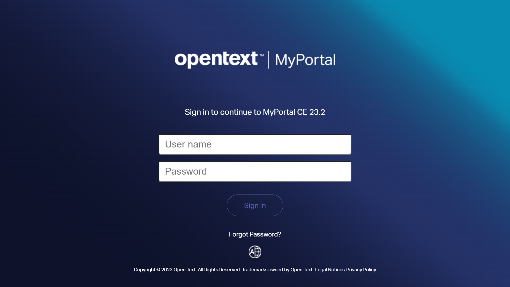	  	

Click on the `Sign in` button to log in.

### User interface desired language

You can change the language used in the user interface doing click on the `world` icon at the bottom of the login page.

 	

At the moment of writing this article, there are 8 languages supported by default.

## Upload a client list

Let's create a new client list from our CSV file. 

Click on `Lists > Manage list > Upload list (icon)`
 
 

The `Upload list` pop-up is shown. Just provide the required information:

 - **List name**: UpdateApp.SMS 
 - **Level**: Customer
 - **List type**: Sms List
 - **Character set**: Unicode (UTF-8)
 - **Choose file**: customer-update_app_sms.csv
 
 

Click on `Upload` button to create the list.

When the import is finished, a pop-up window will appear with a summary of the number of imported records. You can close it by clicking the `Close window` button.

 

## Create a message

Next, we are going to create a message. Just follow these steps:

 - Click on `Jobs > Create/Send job > SMS`
 - Click on `Select stored list` icon

 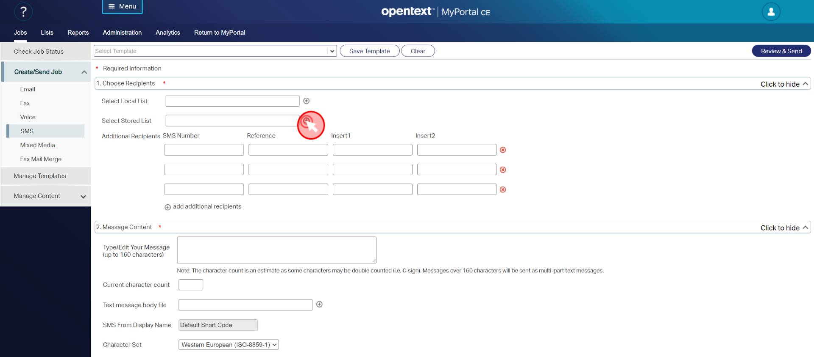
 
In the `Select stored list` pop-up:

 - Select the list created previously (*#updateapp.sms*)
 - Click on `Add` button
 - Click on `Done` button
 
  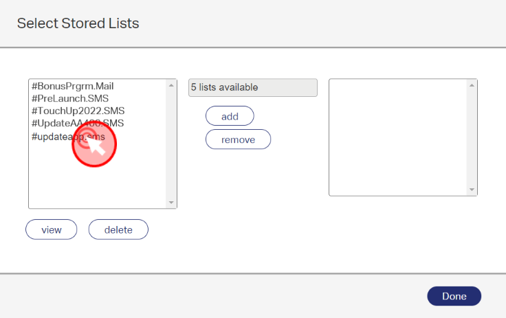
 
 - Introduce the text for your message in the text box `Type/edit your message`, i.e.
 
```
 Hello, a required update for your app has been released. 
 Pls visit www.innovate.com/ to download the latest version 
 and stay up2date
```
  
  
 

Now, let's customize our communication adding some variables.
 
```
 Hello (i1), a required update for your (i4) app has been released. 
 Pls visit www.innovate.com/(i4) to download the latest version 
 and stay up2date
``` 

Where `(i1)` makes references to column `INS_1` (client name) and `(i4)` refers to column `(INS_4)` (app name) in our *CSV* file.

  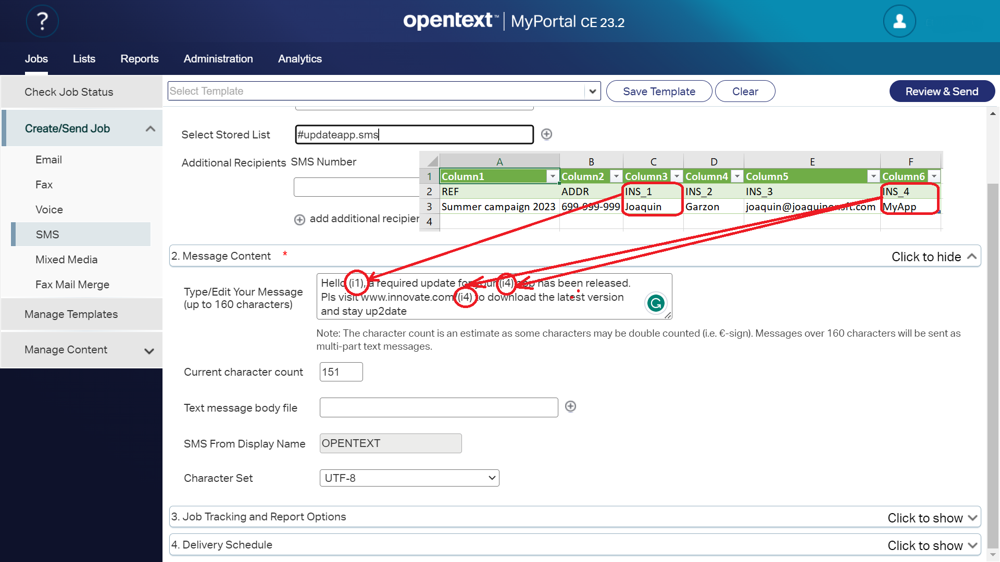
 
 > **NOTE**: Instead of writing a text by myself, I could also select a file that 
 > already contains a meaningful text, using the `Text message body file` option. This can ensure 
 > that the text is created in accordance with company policies and of course it 
 > saves time when dealing with more complex texts with variables and business logic. 

Finally I add the campaign name and the billing code. That makes it easier to find the related report after the SMS has been sent out and create an invoice based on these. Just follow these steps:

 - Click on `Job tracking and Report Options`
 - Provide a `Campaign name (Cust Ref)`, i.e. *Summer campaign 2023*
 - Provide a `Billing code`, i.e. *20230814*

 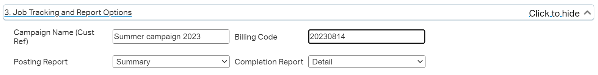
  
 - Click on `Save Template` button at the top of the page
 
  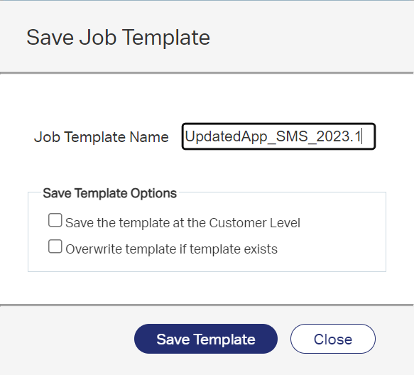
 
 - Provide a `Job Template Name`, i.e. *UpdatedApp_SMS_2023.1*
 - Click on `Save Template`

The template has been saved, next time we don't have to enter the billing code or other details manually nor do I have to select the correct list of recipients. 

> **TIP**: To load a *Job Template* previously saved, just: 
>
> - Browse to `Jobs > Create/Send Job > SMS` 
> - Select a template from the `Select Template` drop-down list 
>
> And everything is back again after selecting the template
 
Click on `Submit` button on the top right-hand side.

The *Job Number* under which I'll find the job report in the next step is shown in a pop-up.
 
  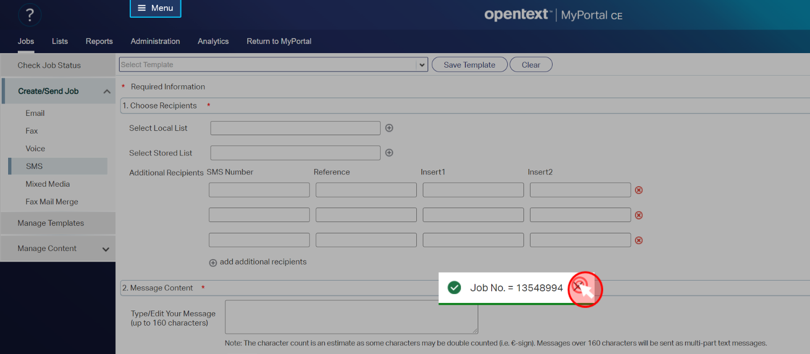 
 
## Check job status

To check the job status click on `Jobs > Check Job Status`. 

Until the job expires, the job number will show up in this section.
 
Click on the job number. 

 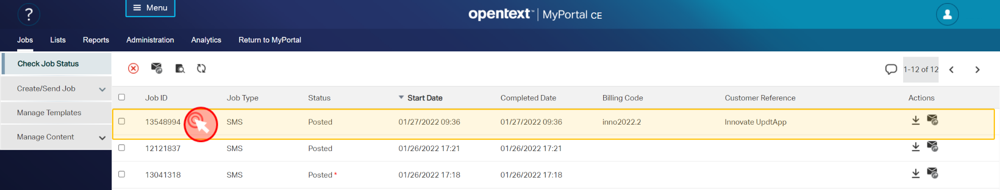 

The `Details for job X` pop-up is shown.

In the bottom line, we can see that our message was processed and sent and that there was no error
 
 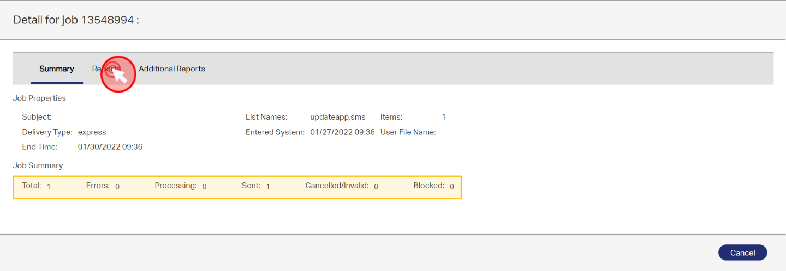  
 
Click on `Reports` tab. You'll see additional information. The most relevant info usually is the `Delivery Receipt` that shows us that the delivery is confirmed (**DELC** = **DEL**ivery *C*onfirmed).
 
 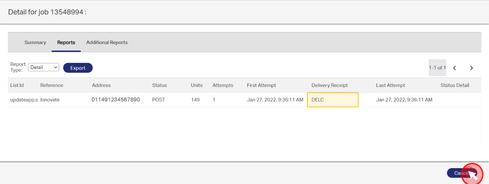   
 

If we want to double-check our message text after we have sent it out, we just need to click on `Download` icon under `Actions` section.

 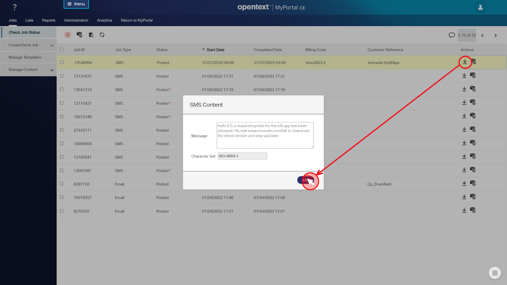   
 
Click on `Ok` button to close the `SMS Content` pop-up.

On our mobile phone, we can see the message exactly as it would  appear on the devices of our customers.

 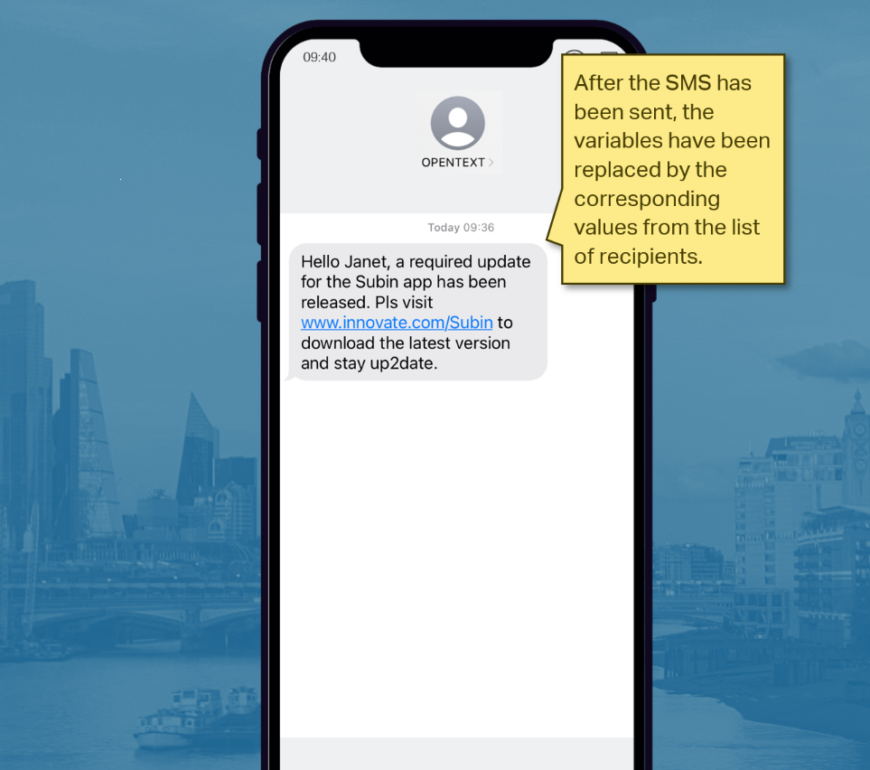   

In addition to checking the status via the frontend, we also get an e-mail that contains the same information. This is important for users who don't have access to the frontend or just don't want to use it as they use the *API* to communicate with **OpenText Notifications**. 

 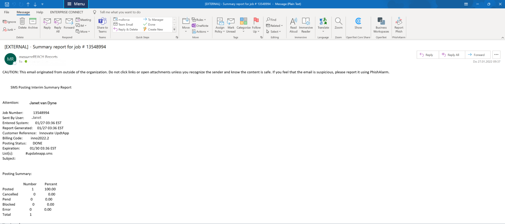   


