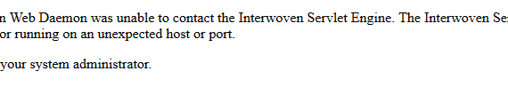

# Certificados caducados en TeamSite



Intentas arrancar tu instancia de TeamSite, el Web Content Management de OpenText, pero en lugar de la pantalla de autenticación ves el siguiente mensaje de error:

The Interwoven Web Daemon was unable to contact the Interwoven Servlet Engine. The Interwoven Servlet Engine may be down, or running on a unexpected host or port.

Please contact your system administrator.

## livesite.preview.log
Vamos a revisar los ficheros de logs para ver que esta ocurriendo. En el fichero de log **livesite.preview.log** encontramos el siguiente mensaje:


```
2020-03-20 10:22:09,223 WARN  [com.interwoven.serverutils100.util.TeamSiteServerStatus] *** Encountered a UtildClientException. ***
2020-03-20 10:22:09,223 WARN  [com.interwoven.serverutils100.util.TeamSiteServerStatus] encounter an error when borrowing object from pool
2020-03-20 10:22:09,223 WARN  [com.interwoven.serverutils100.util.TeamSiteServerStatus] TeamSite server is not yet up... trying again in a bit.
2020-03-20 10:22:19,240 ERROR [com.interwoven.serverutils100.utild.UtildConnectionFactory] openSession error:
com.interwoven.hopi.HopiException: Bad write in server skeletons
	at com.interwoven.hopi.HopiContext.sendData_(HopiContext.java:797)
	at com.interwoven.utild.utild_.Connect(utild_.java:305)
	at com.interwoven.utild.Utild.openSession(Utild.java:88)
	at com.interwoven.serverutils100.utild.UtildConnectionFactory.makeObject(UtildConnectionFactory.java:77)
	at org.apache.commons.pool.impl.GenericObjectPool.borrowObject(GenericObjectPool.java:974)
	at com.interwoven.serverutils100.utild.UtildClient.borrowObject(UtildClient.java:85)
	at com.interwoven.serverutils100.utild.UtildClient.executeSyncCommand(UtildClient.java:141)
	at com.interwoven.serverutils100.util.TeamSiteServerStatus.isTSServerRunning(TeamSiteServerStatus.java:79)
	at com.interwoven.serverutils100.util.TeamSiteServerStatus.isTSServerRunning(TeamSiteServerStatus.java:43)
	at com.interwoven.livesite.spring.web.context.TeamSiteDependentContextLoaderListener.contextInitialized(TeamSiteDependentContextLoaderListener.java:37)
	at org.apache.catalina.core.StandardContext.listenerStart(StandardContext.java:3843)
	at org.apache.catalina.core.StandardContext.start(StandardContext.java:4342)
	at org.apache.catalina.core.ContainerBase.start(ContainerBase.java:1045)
	at org.apache.catalina.core.StandardHost.start(StandardHost.java:719)
	at org.apache.catalina.core.ContainerBase.start(ContainerBase.java:1045)
	at org.apache.catalina.core.StandardEngine.start(StandardEngine.java:443)
	at org.apache.catalina.core.StandardService.start(StandardService.java:516)
	at org.apache.catalina.core.StandardServer.start(StandardServer.java:710)
	at org.apache.catalina.startup.Catalina.start(Catalina.java:578)
	at sun.reflect.NativeMethodAccessorImpl.invoke0(Native Method)
	at sun.reflect.NativeMethodAccessorImpl.invoke(NativeMethodAccessorImpl.java:39)
	at sun.reflect.DelegatingMethodAccessorImpl.invoke(DelegatingMethodAccessorImpl.java:25)
	at java.lang.reflect.Method.invoke(Method.java:597)
	at org.apache.catalina.startup.Bootstrap.start(Bootstrap.java:288)
	at org.apache.catalina.startup.Bootstrap.main(Bootstrap.java:413)
Caused by: javax.net.ssl.SSLHandshakeException: java.security.cert.CertificateException: invalid date: EMAILADDRESS=iwutild@interwoven.com, CN=iwutild.interwoven.com, OU=Engineering, O=Autonomy Interwoven, L=San Jose, ST=CA, C=US
	at com.sun.net.ssl.internal.ssl.Alerts.getSSLException(Alerts.java:174)
	at com.sun.net.ssl.internal.ssl.SSLSocketImpl.fatal(SSLSocketImpl.java:1611)
	at com.sun.net.ssl.internal.ssl.Handshaker.fatalSE(Handshaker.java:187)
	at com.sun.net.ssl.internal.ssl.Handshaker.fatalSE(Handshaker.java:181)
	at com.sun.net.ssl.internal.ssl.ClientHandshaker.serverCertificate(ClientHandshaker.java:1035)
	at com.sun.net.ssl.internal.ssl.ClientHandshaker.processMessage(ClientHandshaker.java:124)
	at com.sun.net.ssl.internal.ssl.Handshaker.processLoop(Handshaker.java:516)
	at com.sun.net.ssl.internal.ssl.Handshaker.process_record(Handshaker.java:454)
	at com.sun.net.ssl.internal.ssl.SSLSocketImpl.readRecord(SSLSocketImpl.java:884)
	at com.sun.net.ssl.internal.ssl.SSLSocketImpl.performInitialHandshake(SSLSocketImpl.java:1112)
	at com.sun.net.ssl.internal.ssl.SSLSocketImpl.writeRecord(SSLSocketImpl.java:623)
	at com.sun.net.ssl.internal.ssl.AppOutputStream.write(AppOutputStream.java:59)
	at java.nio.channels.Channels$WritableByteChannelImpl.write(Channels.java:275)
	at com.interwoven.hopi.HopiChannel.write(HopiChannel.java:333)
	at com.interwoven.hopi.HopiContext.sendData_(HopiContext.java:792)
	... 24 more
Caused by: java.security.cert.CertificateException: invalid date: EMAILADDRESS=iwutild@interwoven.com, CN=iwutild.interwoven.com, OU=Engineering, O=Autonomy Interwoven, L=San Jose, ST=CA, C=US
	at com.interwoven.hopi.HopiTrustManager.checkServerTrusted(HopiTrustManager.java:273)
	at com.sun.net.ssl.internal.ssl.ClientHandshaker.serverCertificate(ClientHandshaker.java:1027)
	... 34 more
2020-03-20 10:22:19,240 WARN  [com.interwoven.serverutils100.util.TeamSiteServerStatus] *** Encountered a UtildClientException. ***
2020-03-20 10:22:19,240 WARN  [com.interwoven.serverutils100.util.TeamSiteServerStatus] encounter an error when borrowing object from pool
2020-03-20 10:22:19,240 ERROR [com.interwoven.serverutils100.util.TeamSiteServerStatus] *** TeamSite server is not reachable or is not running. ***
``` 

¿Que quiere decir este mensaje? Sencillo, el certificado utilizado por TeamSite ha expirado, tenenemos que generar uno nuevo.

 

### Renovación de los certificados de TeamSite
En primer lugar debemos hacer una copia de seguridad de los certificados existentes en los siguientes directorios:

Ubicación de los certificados de TeamSite

```
<iw-home>\iw-webd\conf\ssl.crt\

<iw-home>\iw-webd\conf\ssl.key\

<iw-home>\local\config\ssl\iwutild\
```

Vamos a generar un nuevo certificado SHA-256. Para ellos debemos  iniciar una consola (con privilegios de Administrador) y ejecutar los siguientes comandos:

```
$ cd <iw-home>/private/bin

$ ./gen_ssl.ipl
```

Por último, vamos a generar una nueva licencia con el nombre del servidor:

**Parar todos los servicios** de TeamSite
Ejecutar el siguiente comando desde la consola:

```
$ iwperl <iwhome>/install/cert_install.pl
```

Reiniciar todos los servicios de TeamSite o reiniciar el servidor (recomendado)
 

Eh Voilà! Si accedemos a la URL de nuestro servidor podremos acceder sin problema.


 