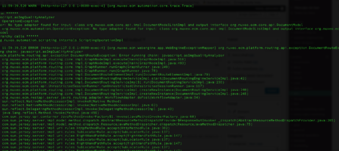

# Como evitar la excepción OperationException: No type adapter found for input: X and output Y

Has configurado un workflow en Nuxeo en el que una de las transiciones entre estado ejecuta un **automation chain/script**. Cuando realizas la primera prueba de tu workflow compruebas que una operación incluid en tu automation chain/script esta fallando con este mensaje

> No type adapter found for input: class org.nuxeo.ecm.core.api.impl.DocumentModelListImpl and output interface org.nuxeo.ecm.core.api.DocumentModel

El mensaje completo que encuentras en el fichero **server.log** tiene este aspecto




```javascript
****** chain ******
Name: javascript.acTest
Exception: OperationException
Caught error: No type adapter found for input: class org.nuxeo.ecm.core.api.impl.DocumentModelListImpl and output interface org.nuxeo.ecm.core.api.DocumentModel
Caused by: org.nuxeo.ecm.automation.OperationException: No type adapter found for input: class org.nuxeo.ecm.core.api.impl.DocumentModelListImpl and output interface org.nuxeo.ecm.core.api.DocumentModel
****** Hierarchy calls ******
	org.nuxeo.automation.scripting.internals.ScriptingOperationImpl

2018-01-22 12:19:22,486 ERROR [http-nio-127.0.0.1-8080-exec-18] [org.nuxeo.ecm.webengine.app.WebEngineExceptionMapper] org.nuxeo.ecm.platform.routing.api.exception.DocumentRouteException: Error running chain: javascript.acTest
org.nuxeo.ecm.platform.routing.api.exception.DocumentRouteException: Error running chain: javascript.acTest
	at org.nuxeo.ecm.platform.routing.core.impl.GraphNodeImpl.executeChain(GraphNodeImpl.java:518)
	at org.nuxeo.ecm.platform.routing.core.impl.GraphNodeImpl.executeTransitionChain(GraphNodeImpl.java:498)
	at org.nuxeo.ecm.platform.routing.core.impl.GraphRunner.runGraph(GraphRunner.java:293)
	at org.nuxeo.ecm.platform.routing.core.impl.GraphRunner.run(GraphRunner.java:78)
	at org.nuxeo.ecm.platform.routing.core.impl.DocumentRouteElementImpl.run(DocumentRouteElementImpl.java:79)
	...
```

Este error se produce porque en el contexto de un workflow un automation chain siempre recibe una lista de documentos. ¡Siempre! Incluso si hemos iniciado el workflow con un sólo documento, recibiremos una lista de un único documento.

Si estamos ejecutando un automation script debemos seguir los siguientes pasos:

   - Cambiar el imput/output a documents (plural)
   - Dentro del automation script, para acceder al documento individual

```javascript
var theDoc = input[0];
```

   - Ahora, *theDoc* es nuestro documento
   - Ahora podemos trabajar con el

```javascript
theDoc["myschema:myfield"] = <somevalue>;
theDoc = Document.Save(theDoc, {});
```

Una vez realizados los cambios en Nuxeo Studio sólo tenemos que desplegar los cambios en nuestra instancia y la exepción habrá desaparecido.