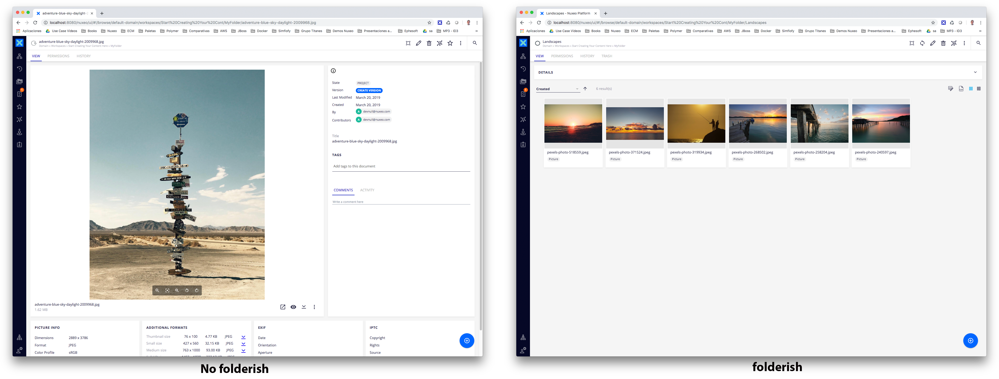
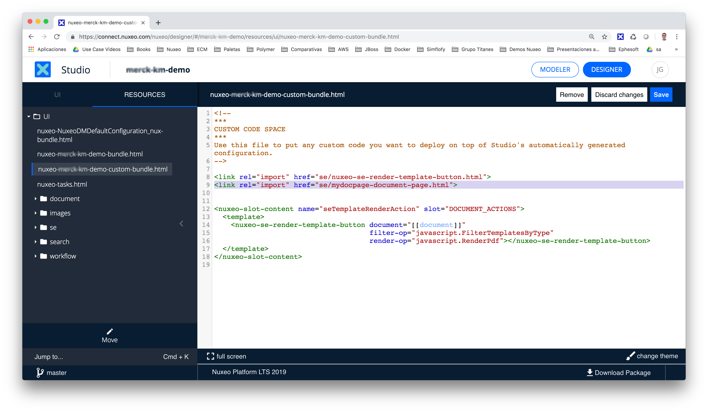

# Como personalizar el layout de la página para un tipo de documento en Nuxeo

Por defecto Nuxeo proporciona dos tipos de layout de página en función de si el documento es «folderish» o no.


 
En ocasiones podemos quere modificar el layout utilizado para un tipo de documento determinado.

Web UI, la interface de usuario de Nuxeo, utiliza el concepto de slot para definir el layout de página para cada tipo de documento.

Podemos pensar en un `<slot>` como un marcador de posición que muestra dónde se representarán los nodos secundarios.

El fichero [nuxeo-web-ui-bundle.html](https://github.com/nuxeo/nuxeo-web-ui/blob/master/elements/nuxeo-web-ui-bundle.html) define los slot predeterminados para documentos **folderish** y no **folderish**:

```HTML
[...]
<nuxeo-slot-content name="documentViewPage" slot="DOCUMENT_VIEWS_PAGES" order="10">
  <template>
    <nuxeo-filter document="[[document]]" expression="document.facets.indexOf('Folderish') === -1
                                                   && document.facets.indexOf('Collection') === -1">
      <template>
        <nuxeo-document-page name="view" document="[[document]]" opened></nuxeo-document-page>
      </template>
    </nuxeo-filter>
  </template>
</nuxeo-slot-content>

<nuxeo-slot-content name="documentCollapsiblePage" slot="DOCUMENT_VIEWS_PAGES" order="10">
  <template>
    <nuxeo-filter document="[[document]]" facet="Folderish,Collection">
      <template>
        <nuxeo-collapsible-document-page name="view" document="[[document]]"></nuxeo-collapsible-document-page>
      </template>
    </nuxeo-filter>
  </template>
</nuxeo-slot-content>
[...]
``` 

## Sobrescribir el layout por defecto para un tipo de documento
Para modificar el layout utilizado para un tipo de documento debemos sobrescribir el layout por defecto. Para ello debemos realizar una contribución en el fichero **MY_PROJECT_bundle.html** de nuestro proyecto.

 

```HTML
<nuxeo-slot-content name="documentViewPage" slot="DOCUMENT_VIEWS_PAGES" order="10">
  <template>
    <nuxeo-filter document="[[document]]" type="MyDocType">
      <template>
        <mydocpage-document-page name="view" document="[[document]]" opened></mydocpage-document-page>
      </template>
    </nuxeo-filter>
  </template>
</nuxeo-slot-content><br>
```

Debemos prestar atención a varios detalles:

El slot esta sobrescribiendo el layout para el tipo de documento MyDocType
``xml
    <nuxeo-filter document="[[document]]" type="MyDocType">
```

> **ATENCIÓN**: Podemos especificar más the un tipo de documento (separado por comas) en el atributo «type«

```xml
    <nuxeo-filter document="[[document]]" type="MyDocType,MyDocType2,MyDocType3">
```

El nuevo layout se define en el web element
```xml 
 <mydocpage-document-page name="view" document="[[document]]" opened></mydocpage-document-page>
```

En este ejemplo vamos a eliminar la sección de información, donde se muestra la información de Estado, Versión, Última modificación… El nuevo layout definido en el web element mydocpage-document-page.html tendrá un aspecto similar a este:

```html 
<!--
`mydocpage-document-page`
@group Nuxeo UI
@element mydocpage-document-page
-->
<dom-module id="mydocpage-document-page">
  <template>
    <style include="nuxeo-styles">
      #details {
        width: 28px;
        height: 28px;
        padding: 5px;
        opacity: 0.3;
        margin: 6px 0;
      }

      :host([opened]) #details {
        opacity: 1;
        margin-left: 6px;
      }

      #documentViewsItems {
        @apply --layout-horizontal;
        --paper-listbox-background-color: transparent;
      }

      #documentViewsItems > [name='comments'] {
        margin: 0;
      }

      .scrollerHeader {
        @apply --layout-horizontal;
      }

      :host([opened]) .scrollerHeader {
        box-shadow: 0 3px 5px rgba(0,0,0,0.04) !important;
        border-radius: 0;
        background-color: var(--nuxeo-box) !important;
      }

      .page {
        @apply --layout-horizontal;
      }

      .main {
        @apply --layout-vertical;
        @apply --layout-flex-2;
        padding-right: 8px;
        overflow: hidden;
      }

      :host([opened]) .main {
        padding-right: 16px;
      }

      .side {
        @apply --layout-vertical;
        position: relative;
        margin-bottom: var(--nuxeo-card-margin-bottom, 16px);
        min-height: 60vh;
      }

      :host([opened]) .side {
        @apply --layout-flex;
      }

      .scroller {
        @apply --nuxeo-card;
        margin-bottom: 0;
        overflow: auto;
        display: none;
        left: 0;
        top: 36px;
        right: 0;
        bottom: 0;
        position: absolute;
      }

      :host([opened]) .scroller {
        display: block;
      }

      .section {
        margin-bottom: 32px;
      }

      .section:last-of-type {
        margin-bottom: 64px;
      }

      nuxeo-document-view {
        --nuxeo-document-content-margin-bottom: var(--nuxeo-card-margin-bottom);
      }

      @media (max-width: 1024px) {
        #details {
          opacity: 1;
          margin-left: 6px;
          cursor: default;
        }

        .scrollerHeader {
          box-shadow: 0 3px 5px rgba(0,0,0,0.04) !important;
          font-family: var(--nuxeo-app-font);
          border-radius: 0;
          background-color: var(--nuxeo-box) !important;
        }

        .page {
          @apply --layout-vertical;
        }

        .main,
        :host([opened]) .main {
          padding: 0;
          max-width: initial;
          margin-right: 0;
        }

        .side {
          padding: 0;
          max-width: initial;
          min-height: initial;
          display: block;
          margin-bottom: 16px;
        }

        .scroller {
          top: 0;
          position: relative;
          display: block;
        }
      }
    </style>

    <nuxeo-document-info-bar document="[[document]]"></nuxeo-document-info-bar>

    <div class="page">

      <div class="main">
        <nuxeo-document-view document="[[document]]"></nuxeo-document-view>
      </div>

      <div class="side">
        <div class="scrollerHeader">
          <paper-icon-button id="details" noink icon="nuxeo:details" on-tap="_toggleOpened"></paper-icon-button>
          <nuxeo-tooltip for="details">[[i18n('documentPage.details.opened')]]</nuxeo-tooltip>
        </div>
        <div class="scroller">
          <!-- info -->
          <!--
          <div class="section">
            <nuxeo-document-info document="[[document]]"></nuxeo-document-info>
          </div>
          -->

          <!-- metadata -->
          <div class="section">
            <nuxeo-document-metadata document="[[document]]"></nuxeo-document-metadata>
          </div>

          <!-- collections -->
          <div class="section" hidden$="[[!_hasCollections(document)]]">
            <h3>[[i18n('documentPage.collections')]]</h3>
            <nuxeo-document-collections document="[[document]]"></nuxeo-document-collections>
          </div>

          <!-- tags -->
          <template is="dom-if" if="[[hasFacet(document, 'NXTag')]]">
            <div class="section">
              <h3>[[i18n('documentPage.tags')]]</h3>
              <nuxeo-tag-suggestion document="[[document]]" allow-new-tags
                                    placeholder="[[i18n('documentPage.tags.placeholder')]]"
                                    readonly="[[!isTaggable(document)]]">
              </nuxeo-tag-suggestion>
            </div>
          </template>

          <!-- activity -->
          <div class="section">
            <paper-listbox id="documentViewsItems" selected="{{selectedTab}}" attr-for-selected="name">
              <nuxeo-page-item name="comments" label="[[i18n('documentPage.comments')]]"></nuxeo-page-item>
              <nuxeo-page-item name="activity" label="[[i18n('documentPage.activity')]]"></nuxeo-page-item>
            </paper-listbox>
            <iron-pages selected="[[selectedTab]]" attr-for-selected="name" selected-item="{{page}}">
              <nuxeo-document-comment-thread name="comments" uid="[[document.uid]]"></nuxeo-document-comment-thread>
              <nuxeo-document-activity name="activity" document="[[document]]"></nuxeo-document-activity>
            </iron-pages>
          </div>
        </div>
      </div>
    </div>

  </template>
  <script>
    Polymer({
      is: 'mydocpage-document-page',
      behaviors: [Nuxeo.LayoutBehavior],
      properties: {
        document: {
          type: Object
        },
        selectedTab: {
          type: String,
          value: 'comments',
          notify: true
        },
        opened: {
          type: Boolean,
          value: false,
          notify: true,
          reflectToAttribute: true,
          observer: '_openedChanged',
        }
      },

      _openedChanged: function() {
        Polymer.Async.animationFrame.run(function() {
          // notify that there was a resize
          this.dispatchEvent(new CustomEvent('resize', {
            bubbles: false,
            composed: true,
          }));
        });
      },

      _toggleOpened: function() {
        this.opened = !this.opened;
      },

      _isMutable: function(doc) {
        return !this.hasFacet(doc, 'Immutable') && doc.type !== 'Root' && !this.isTrashed(doc);
      },

      _hasCollections: function(doc) {
        return this.hasCollections(doc);
      }
    });
  </script>

</dom-module>
```

Este web component esta basado en el componente [nuxeo-document-page](https://github.com/nuxeo/nuxeo-web-ui/blob/master/elements/document/nuxeo-document-page.js). En este ejemplo hemos partido de la vesión asociada con la versión LTS 2019 (10.10) de Nuxeo.

Es importante usar la versión de nuxeo-document-page correspondiente a la versión de Nuxeo que estamos utilizando en nuestro proyecto.

Otra opción consistiría en utilizar el web component [nuxeo-collapsible-document-page](https://github.com/nuxeo/nuxeo-web-ui/blob/master/elements/document/nuxeo-collapsible-document-page.js) como punto de partida.

No debemos olvidar añadir el import correspondiente a nuesto nuevo web element en el fichero MY_PROJECT_custom_bundle.html de nuestro proyecto.


