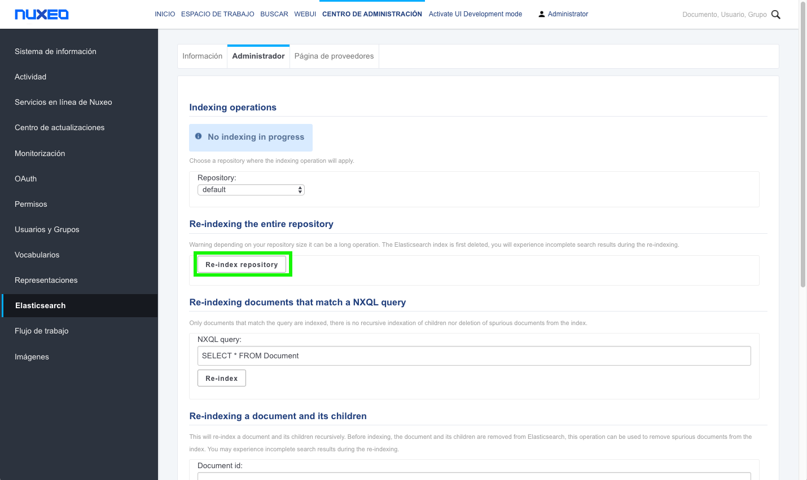

# Configurar mapping elasticsearch en Nuxeo

La configuración predeterminada de Nuxeo define un **mapping de Elasticsearch** que puede funcionar con campos personalizados de nuestros esquemas, pero de forma limitada. Para aprovechar las capacidades de búsqueda de Elasticsearch debemos definir nuestro propio mapping, por ejemplo en los siguientes casos:

   * Utilizar un analizador personalizado para un idioma distinto del inglés
   * Utilizar operadores NXQL específicos en un campo personalizado: ILIKE, ecm: fulltext.custom, STARTSWITH
   * Excluir un campo de la búsqueda de texto completo (fulltext)
   * Ordenar por un campo personalizado que puede no existir

Para esto, tenemos que crear una plantilla personalizada que redefina  el mapping de Elasticsearch.

> Nuxeo actualiza el mapping en Elasticsearch solo cuando:
> 
> El índice Elasticsearch no existe
> Se reindexa un repositorio completo

 

## Cambiar el mapping y configuración de índices
La configuración predeterminada de Nuxeo define un mapping que establece la configuración regional para el texto completo y declara que algunos campos son de fecha o numéricos.

El mapping predeterminado se encuentra en:

```shell
${NUXEO_HOME}/templates/common-base/nxserver/config/elasticsearch-config.xml.nxftl
```

Para poner a punto y sobrescribir el mapping predeterminado debemos seguir estos pasos:

   * Crear una **plantilla personalizada** (una estructura de directorios) como **myapp**, que cuelgue del directorio **${NUXEO_HOME}/templates/**, y que organiazada así:
``` 
myapp
├── nuxeo.defaults
└── nxserver
    └── config
       	└── elasticsearch-myapp-config.xml.nxftl
``` 

El fichero **nuxeo.defaults** contiene:

``` 
myapp.target=.
``` 

   * Crear el fichero **elasticsearch-myapp-config.xml.nxftl** en el directorio **${NUXEO_HOME}/templates/nxserver/config** y sobrescribir la configuración del mapeo.
   
```xml 
<component name="org.nuxeo.elasticsearch.myapp">
  <require>org.nuxeo.elasticsearch.defaultConfig</require>
  <extension target="org.nuxeo.elasticsearch.ElasticSearchComponent"
    point="elasticSearchIndex">
    <elasticSearchIndex name="nuxeo" type="doc" repository="default">
     <mapping>

      ... Here copy and adapt the default mapping

     </mapping>
    </elasticSearchIndex>
  </extension>
</component>
``` 

   * Actualizar el fichero **nuxeo.conf** para utilizar nuestra plantilla.
```shell 
##-----------------------------------------------------------------------------
## General parameters
##-----------------------------------------------------------------------------
## Will regenerate config from these parameters each time the server
##  is restarted
nuxeo.force.generation=true
nuxeo.templates=postgresql,drive,myapp
#nuxeo.bind.address=0.0.0.0
#nuxeo.url=http://localhost:8080/nuxeo
#org.nuxeo.ecm.contextPath=/nuxeo
#org.nuxeo.ecm.product.name=
#org.nuxeo.ecm.product.version=
```  

## Reiniciar el servidor
Re-indexar el repositorio desde la pestaña Administración **(CENTRO DE ADMINISTRACIÓN > Elasticsearch > Administrador > Re-index repository)** 


 

## Configurar el mapping de Elasticsearch


Ya hemos visto como crear una plantilla personalizada.  A continuación veremos como configurar el mapping de Elasticseach en Nuxeo para dos casos de uso habituales.

 
 
## Indexar el contenido del archivo adjunto principal para usar con el operador common
En la sección  de configuración correspondiente al analizador,  tenemos que añadir un nuevo analizador que utilizaremos para indexar el contenido del archivo adjunto principal:

```json
"analyzer" : {

     ...

     "my_attachment_analyzer" : {
          "type" : "custom",
          "filter" : [
               "word_delimiter_filter",
               "lowercase",
               "asciifolding"
          ],
          "tokenizer" : "standard"
     },

     ...

}
``` 

Debemos actualizar la configuración de mapping del campo ecm: binarytext a la siguiente:

```json
"properties" : {

    ...

    "ecm:binarytext" : {
        "type" : "multi_field",
        "fields" : {
            "ecm:binarytext" : {
                "type" : "string",
                "index" : "no",
                "include_in_all" : true
            },
            "common" : {
                "type": "string",
                "analyzer" : "my_attachment_analyzer",
                "include_in_all" : false
            }
        }
    },

    ...

}
``` 
 

## Añadir un nuevo campo de texto completo

Para utilizar la sintaxis de búsqueda de texto completo en un campo personalizado, debe crear un campo múltiple con un índice de texto completo como este:

```json
"eval:nif" : {
    "type" : "multi_field",
    "fields" : {
        "eval:nif" : {
            "include_in_all" : "true",
            "type" : "string"
        },
        "fulltext" : {
            "type": "string",
            "analyzer" : "fulltext"
        }
    }
},
``` 

## elasticsearch-myapp-config.xml.nxftl completo
Este es el aspecto que tendría el fichero *elasticsearch-myapp-config.xml.nxftl* completo en nuestro ejemplo:

```xml
<#escape x as x?xml>
<?xml version="1.0"?>
<component name="org.nuxeo.elasticsearch.myapp">
  <require>org.nuxeo.elasticsearch.ElasticSearchComponent</require>

<#if "${elasticsearch.addressList}" == "">
  <extension target="org.nuxeo.elasticsearch.ElasticSearchComponent"
    point="elasticSearchLocal">
    <elasticSearchLocal
      clusterName="${elasticsearch.clusterName}"
      nodeName="${elasticsearch.nodeName}"
      pathData="${nuxeo.data.dir}/elasticsearch"
      pathLogs="${nuxeo.log.dir}/elasticsearch"
      httpEnabled="${elasticsearch.httpEnabled}"
      networkHost="${elasticsearch.networkHost}" />
  </extension>
<#else>
  <extension target="org.nuxeo.elasticsearch.ElasticSearchComponent"
    point="elasticSearchRemote">
    <elasticSearchRemote
      clusterName="${elasticsearch.clusterName}"
      addressList="${elasticsearch.addressList}"
      clientTransportSniff="false"
      clientTransportIgnoreClusterName="false"
      clientTransportPingTimeout="5s"
      clientTransportNodesSamplerInterval="5s" />
  </extension>
</#if>
<#if (elasticsearch.shield.enabled)?? && "${elasticsearch.shield.enabled}" == "true">
  <extension target="org.nuxeo.elasticsearch.ElasticSearchComponent" point="elasticSearchClientInitialization">
    <clientInitialization class="org.nuxeo.elasticsearch.shield.ShieldInitializationService">
      <username>${elasticsearch.shield.username}</username>
      <password>${elasticsearch.shield.password}</password>
      <#if elasticsearch.shield.keystore.path??>
      <sslKeystorePath>${elasticsearch.shield.keystore.path}</sslKeystorePath>
      </#if>
      <#if elasticsearch.shield.keystore.password??>
      <sslKeystorePassword>${elasticsearch.shield.keystore.password}</sslKeystorePassword>
      </#if>
    </clientInitialization>
</extension>
<#else>
  <extension target="org.nuxeo.elasticsearch.ElasticSearchComponent" point="elasticSearchClientInitialization">
    <clientInitialization class="org.nuxeo.elasticsearch.core.ESClientInitializationServiceImpl"/>
  </extension>
</#if>

  <extension target="org.nuxeo.elasticsearch.ElasticSearchComponent"
    point="elasticSearchIndex">
    <elasticSearchIndex name="${elasticsearch.indexName}" type="doc" repository="default">
      <fetchFromSource>
        <include>ecm:*</include>
        <include>dc:*</include>
        <exclude>ecm:binarytext</exclude>
      </fetchFromSource>

      <settings>
{
<#if "${elasticsearch.addressList}" != "">
   "number_of_shards" : "${elasticsearch.indexNumberOfShards}",
   "number_of_replicas" : "${elasticsearch.indexNumberOfReplicas}",
</#if>
   "analysis" : {
      "filter" : {
         "truncate_filter" : {
            "length" : 256,
            "type" : "truncate"
         },
         "word_delimiter_filter" : {
           "type" : "word_delimiter",
           "preserve_original" : true
         },
         "asciifolding_filter" : {
            "type" : "asciifolding",
            "preserve_original" : true
         },
         "en_stem_filter" : {
            "name" : "minimal_english",
            "type" : "stemmer"
         },
         "en_stop_filter" : {
            "stopwords" : [
               "_english_"
            ],
            "type" : "stop"
         },
         "fr_elision_filter" : {
            "articles" : [
               "c",
               "l",
               "m",
               "t",
               "qu",
               "n",
               "s",
               "j"
            ],
            "type" : "elision"
         },
         "fr_stem_filter" : {
            "name" : "minimal_french",
            "type" : "stemmer"
         },
         "fr_stop_filter" : {
            "stopwords" : [
               "_french_"
            ],
            "type" : "stop"
         }
      },
      "tokenizer" : {
         "path_tokenizer" : {
            "delimiter" : "/",
            "type" : "path_hierarchy"
         }
      },
      "analyzer" : {
         "en_analyzer" : {
            "alias" : "fulltext",
            "char_filter":  [ "html_strip"],
            "filter" : [
               "word_delimiter_filter",
               "lowercase",
               "en_stop_filter",
               "en_stem_filter",
               "asciifolding_filter"
            ],
            "type" : "custom",
            "tokenizer" : "standard"
         },
         "fr_analyzer" : {
            "char_filter":  [ "html_strip"],
            "filter" : [
               "word_delimiter_filter",
               "lowercase",
               "fr_stop_filter",
               "fr_stem_filter",
               "asciifolding_filter",
               "fr_elision_filter"
            ],
            "type" : "custom",
            "tokenizer" : "standard"
         },
         "path_analyzer" : {
            "type" : "custom",
            "tokenizer" : "path_tokenizer"
         },
         "lowercase_analyzer" : {
            "type" : "custom",
            "filter" : [ "truncate_filter", "lowercase", "asciifolding" ],
            "tokenizer" : "keyword"
         },
         "my_attachment_analyzer" : {
            "type" : "custom",
              "filter" : [
                "word_delimiter_filter",
                "lowercase",
                "asciifolding"
              ],
            "tokenizer" : "standard"
          },
         "default" : {
            "type" : "custom",
            "filter" : [ "truncate_filter" ],
            "tokenizer" : "keyword"
         }
      }
   }

      </settings>
      <mapping>
{
   "_all" : {
      "analyzer" : "fulltext"
   },
   "dynamic_templates": [ {
      "no_thumbnail_template": {
         "path_match": "thumb:thumbnail.*",
         "mapping": {
             "index": "no",
             "include_in_all": false
            }
         }
      }, {
      "no_picture_template": {
         "path_match": "picture:views.*",
         "mapping": {
            "index": "no",
            "include_in_all": false
          }
       }
   } ],
   "properties" : {
      "dc:title" : {
         "type" : "multi_field",
         "fields" : {
           "dc:title" : {
             "type" : "string"
           },
           "fulltext" : {
             "boost": 2,
             "type": "string",
             "analyzer" : "fulltext"
          }
        }
      },
      "dc:description" : {
         "type" : "multi_field",
         "fields" : {
           "dc:description" : {
             "index" : "no",
             "include_in_all" : true,
             "type" : "string"
           },
           "fulltext" : {
             "boost": 1.5,
             "type": "string",
             "analyzer" : "fulltext"
          }
        }
      },
      "note:note" : {
         "type" : "multi_field",
         "fields" : {
           "note:note" : {
             "index" : "no",
             "include_in_all" : true,
             "type" : "string"
           },
           "fulltext" : {
             "type": "string",
             "analyzer" : "fulltext"
          }
        }
      },
      "ecm:binarytext" : {
        "type" : "multi_field",
        "fields" : {
          "ecm:binarytext" : {
            "type" : "string",
            "index" : "no",
            "include_in_all" : true
          },
          "common" : {
            "type": "string",
            "analyzer" : "my_attachment_analyzer",
            "include_in_all" : false
          }
        }
      },
      "ecm:path" : {
         "type" : "multi_field",
         "fields" : {
            "children" : {
               "analyzer" : "path_analyzer",
               "search_analyzer" : "keyword",
               "type" : "string"
            },
            "ecm:path" : {
               "index" : "not_analyzed",
               "type" : "string"
            }
         }
      },
      "ecm:pos": {
         "type": "integer"
      },
      "dc:created": {
         "format": "dateOptionalTime",
         "type": "date"
      },
      "dc:expired": {
         "format": "dateOptionalTime",
         "type": "date"
      },
      "dc:modified": {
         "format": "dateOptionalTime",
         "type": "date"
      },
      "common:icon": {
         "type": "string",
         "index" : "no",
         "include_in_all" : false
      },
      "eval:nif" : {
        "type" : "multi_field",
        "fields" : {
          "eval:nif" : {
            "include_in_all" : "true",
            "type" : "string"
          },
        "fulltext" : {
            "type": "string",
            "analyzer" : "fulltext"
          }
        }
      }      
   }
}
      </mapping>

    </elasticSearchIndex>
  </extension>

</component>
</#escape>
```  

## Lecturas recomendadas
[Elasticsearch Setup](https://doc.nuxeo.com/810/nxdoc/elasticsearch-setup/)

[Configuring the Elasticsearch Mapping](https://doc.nuxeo.com/810/nxdoc/configuring-the-elasticsearch-mapping/)