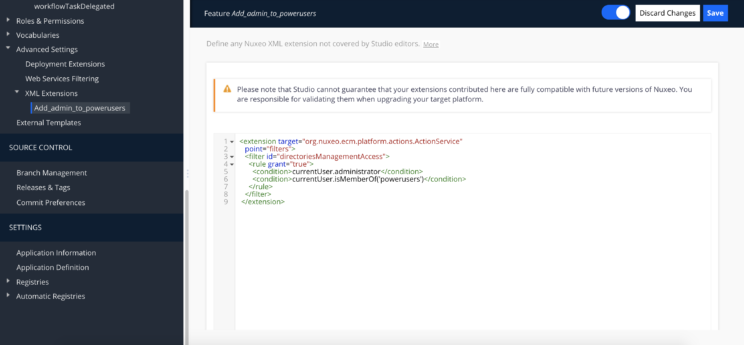

# Ejecutar operaciones con permisos restringidos en Automation Script


Nuxeo proporciona más de 350 operaciones que podemos utilizar desde Automation Scripts, Automation Chains… Algunas de estas operaciones requieren que el usuario tenga deteminados privilegios para poder ejecutarlas. Sin embargo a veces necesitamos ejecutar una operación con un usuario que no tiene los permisos necesarios.

> Puedes consultarlas todas las operaciones disponibles en [Nuxeo Platform Explorer](http://explorer.nuxeo.com/nuxeo/site/distribution/Nuxeo%20Platform-10.1/listOperations)

Para poder saltarnos esta limitación podemos iniciar sesión con un usuario con los permisos necesarios utilizando  la operación **Auth.LoginAs (Iniciar sesión como)**. La operación **Auth.LoginAs** generalmente se usa en asociación con la operación **Auth.Logout (Cerrar sesión)** para que todas las operaciones incluidas entre Auth.LoginAs y Auth.Logout se ejecuten como si el usuario con el que nos hemos autenticado hubiera iniciado sesión. Después de eso, el usuario conectado previamente volverá a iniciar sesión automáticamente (no es necesario para «iniciar sesión como» nuevamente).

```javascript 
function run(input, params) {

       var resultBlob, resultJson, resultStr;

      Auth.LoginAs(input, {'name': 'Administrator'});

      // Directory.Entries returns a `org.nuxeo.ecm.core.api.impl.blob.JSONBlob` 
      // This means it is a _java_ object. That contains (in this context) a _string_. 
      // So you must (1) Extract the string from the blob (2) Convert it to JSON. 
      // Notice that toString() will not work here, it calls the generic function. 
      // So, you must call `getString()` from the result, then `JSON.parse
      resultBlob = Directory.Entries(null, { "directoryName": predicatesName });
      
      Auth.Logout(input, {});
      
      // Get the content of the blob, as string
      resultStr = resultBlob.getString();
      
      // Parse it to get a JSON array
      resultJson = JSON.parse(resultStr);     
      
      // 
      // Do your stuff
      // 
}
```

> Failed to invoke operation User.Get with aliases [NuxeoPrincipal.Get], Unauthorized user
 

En el momento de escribir este artículo al ejecutar la operación **User.Get** entre un inicio y fin de sesión como Administrador la invocación falla con este error:

> Failed to invoke operation User.Get with aliases [NuxeoPrincipal.Get], Unauthorized user

Se trata de un error conocico, **NXP-25153**. Mientras se publica un parche o una nueva versión que lo subsane podemos solvertalo creando una nueva **Extensión XML** desde el menú **Advanced settings > XML Extensions** de Nuxeo Studio para añadir al Aministrador al grupo de Power Users:




```xml 
<extension target="org.nuxeo.ecm.platform.actions.ActionService"
    point="filters">
    <filter id="directoriesManagementAccess">
      <rule grant="true">
        <condition>currentUser.administrator</condition>
        <condition>currentUser.isMemberOf('powerusers')</condition>
      </rule>
    </filter>
  </extension>
``` 