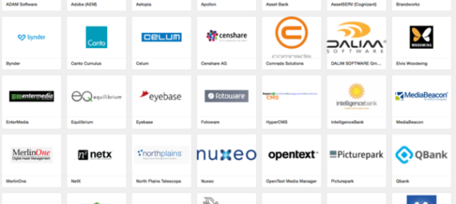
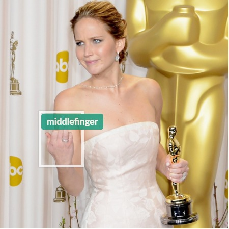
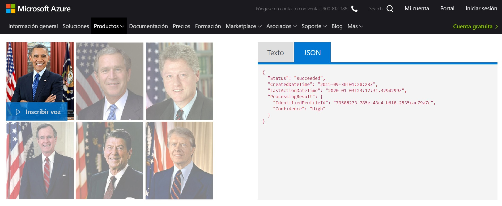
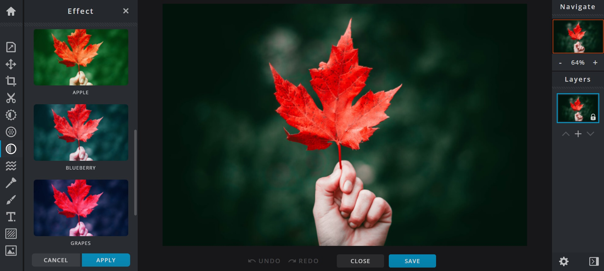

# El futuro del DAM II (continuación)



En el artículo anterior, [El futuro del DAM](el-futuro-del-dam), apuntaba las funcionalidades que, desde mi punto de vista, debe incluir una plataforma DAM (Digital Assets Management). Algunas funcionalidades se quedaron en el tintero, hoy continuemos con el futuro del DAM en Enero de 2020

## Moderación automática de contenido
El sistema debe ser capaz de detectar y filtrar contenido no deseado (desnudos, armas, violencia, drogas…) en fotos y videos.  Existen diversas platarformas que ofrecen APIs cuya integración puede facilitar este tipo funcionalidad como [Sightengine](https://sightengine.com/), [Azure](https://azure.microsoft.com/es-es/services/cognitive-services/content-moderator/) o [Amazon Rekognition](https://aws.amazon.com/es/about-aws/whats-new/2019/02/improved-content-moderation-is-now-available-for-amazon-Rekognition-video/).



## Análisis de la calidad de la imagen
Un caso de uso frecuente consiste en utilizar tu DAM para almacenar imágenes de productos. En este escenario suelen existir una reglas que toda imagen debe cumplir. Habitualmente hay un tamaño predefinido y no se admiten imágenes borrosas o con un contraste o brillo anormal.

Es aquí donde nos volvemos a enconrar servicios como [Image Quality & Colors de Sightengin](https://sightengine.com/image-quality-main-colors) o [ImageQuality API de Amazon Rekognition](https://docs.aws.amazon.com/rekognition/latest/dg/API_ImageQuality.html) que nos permiten detectar y filtrar fotos que estén demasiado borrosas, que no tengan una parte nítida enfocada y tengan una baja calidad percibida, así como  fotos demasiado oscuras o demasiado brillantes.

Cada vez que subamos a una imagen se debe analizar en segundo plano. Si no cumple los criterios de calidad definidos se debe rechazar. En este punto se asignará una tarea a la persona que subio  la imagen para que la actualice con una nueva versión que cumpla los criterios de calidad.

##Generación de subtítulos
Varios de los DAM disponibles el mercado ofrecen la transcripción de voz a texto de los videos. ¿Por que no ir un paso más alla? ¿Por que no generar un fichero de subtítulos a partir de la transcripción? Una buena opción podría ser el formato **SubRip (.srt)**.

SubRip (.srt) es un formato que está muy extendido y es soportado por la mayoría de reproductores multimedia que permiten mostrar subtítulos. Los ficheros SRT son texto plano con formato. Este es un ejemplo de fichero .srt:

```
1
00:00:00,394 --> 00:00:03,031
¿Eres un ángel?

2
00:00:03,510 --> 00:00:05,154
¿Un ángel?

3
00:00:05,274 --> 00:00:07,021
Sí, he oído hablar de ellos a los pilotos del espacio profundo. 
Son los seres más hermosos del universo
```
Además el formato SubRip es un buen punto de partida para hacer la conversión entre diferentes formatos de subtítulos si es necesario.

 
## Identificación del hablante
En algunos escenarios no importa solo que se dice, sino también quien lo dice. Por ejemplo, en la transcripción de un programa de noticias es importante saber si quien esta hablando es el presidente del gobierno, el lider de la oposición…

La identificación del hablante o **Speaker recognition** como producto esta aún en sus etapas tempranas. Productos como [Azure speaker recognition](https://azure.microsoft.com/es-es/services/cognitive-services/speaker-recognition/) permiten identificar al hablante, pero debemos grabar 3 muestras de audio para registrar la voz en el servicio y poder ser reconocidos.

Desde mi punto de vista, estos productos deberían proporcionar una conjunto de voces de personalidades (políticos, deportistas, artístas…) de diferentes países como punto de partida.



Así cuando el sistema analice una voz diciendo «todo es falso salvo alguna cosa» debería identificar  al orador como Mariano Rajoy.


## Edición básica de imágenes
Poder recortar un fragmento de la imagen (cropping), exportar en un formato distinto al original (.png, .jpg, .gif…), eliminar fondos, aplicar efectos y filtros predefinidos… son algunas de las funcionalidades de edición de fotografía que se deberían incluir como un complemento.

Algo similar al **editor de** [pixlr.com](http://pixlr.com/) o los **filtros de Instagram**, es decir, una herramienta que nos permita obtener resultados atractivos en un par de clicks sin necesidad de ser un experto en Photoshop.



Ya se que muchos DAM permiten generar diversas versiones de una misma fotrografía (renditions), pero normalmente requieren una configuración previa que no siempre es sencilla. Además no siempre conocemos los formatos o tamaños de imagen que vamos a necesitar.

Se trata de ofrecer la opción de obtener resultados atractivos seleccionando alguna de las opciones predefinidas.

## Generación de micro sites
En ocasiones queremos seleccionar un cojunto de assets y compartirlos, hacerlos accesibles a otros fuera de la organización a través de una web pública.

Nuestro DAM debe ser capaz de generar una web pública a partir de una colección de assets, incluyendo los metadatos  de nuestra elección, todos o un subconjunto, asociados a cada activo.

La web pública debe permitir definir un control de acceso opcional, así como el tiempo durante el que la web será accesible (indefinidamente o entre dos fechas concretas).

## Archivado
Hay activos que no «caducan», pero hay otros que solo tienen valided durante un determinado periodo de tiempo. Pasado ese periodo podemos querer eliminar el activo o simplemente moverlo a un sistema de almacenamiento más barato.

Nuestro DAM debe permitir definir políticas de archivado desde la interface de usuario, sin necesidad de pasar por ficheros de configuración XML o modificaciones en base de datos.

## Datos compuestos
Hay activos que estan compuestos por más de un fichero como los ficheros de InDesgin o de objetos 3D (.stl, .obj, 3ds…). En muchos DAM la gestión de estos activos se limita a su almancenamiento y  previsualización.

Es importante gestionar todos los ficheros que componen el activo como un todo, manteniendo las relaciones entre los distintos ficheros que componen el activo, permitiendo su manipulación.