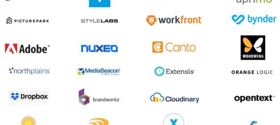
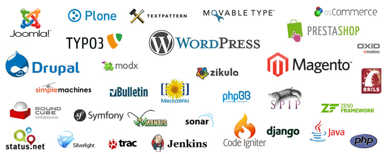
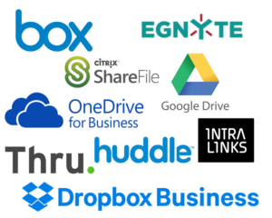

# El futuro del DAM

¿Qué funcionalidades debe incluir un software de Gestión de Activos Digitales o DAM (Digital Assets Management), por sus siglas en inglés? Tu respuesta suele depender de las necesidades  con las que te enfrentas a diario, o has conocido a lo largo del tiempo. A continuación revisaré las que, para mí, son las características que no deberían faltar en un sistema DAM. Veamos el futuro del DAM en Noviembre de 2019.

## El futuro del DAM hoy
Algunas de las funcionalidades que describo están disponibles en productos comerciales. Otras existen como  personalizaciones para clientes, pero no han sido incluidas en el producto. Finalmente, hay un un conjunto de característics que simplemente son parte de mi carta a los Reyes Magos.

## Google-like search o búsqueda amigable de activos
Cuando trabajas con miles, millones o billones de activos encontrar lo que necesitas puede ser una tarea titánica. Por eso, una búsqueda tipo Google, en la que se busque tanto en los metadatos asociados al contenido como en el propio activo es fundamental. Para ello es necesario indexar el contenido utilizando soluciones como ElasticSearch, Solr o similar.

## Search «More like this» o Buscar activos como este
En ocasiones tenemos un activo, pero queremos saber si existen más activos similares a este, ya sea por quien o que aparece en el activo (personas, lugares…), colores predominantes, textos incluidos en las imágenes o videos.

Para ello es importante la aplicación de técnicas de visión artificial, que nos permitan asociar metadatos automáticamente con el contenido y finalmente ser capaz de buscar en ellos.

## Transcripción del audio de los videos
Las tecnologías de **transcripción de audio**, o **Speech To Text (STT)**, han evolucionado mucho en los últimos años, llegando a preciones superiores al 90%. Muchas de ellas de mano de los asistentes virtuales tipo Alexa, Siri, Cortana, Google Assistant…

Nuestro DAM tiene que generar las transcripciones de los audios de los videos  que añadamos, de forma transparente al usuario, siempre en segundo plano. Estas transcripciones deben ser indexadas para poder realizar búsquedas sobre ellas.

## Identificación del hablante
Una vuelta de tuerca adicional sobre el concepto de la transcripción de audio consite en la **identificación del hablante (speaker recognition)**, es decir, no solo identificar que se ha dicho sino también quien lo ha dicho. Por ejemplo, en una entrevista a un deportista tras la final de Roland Garros, no sólo saber que dice, sino también identificar quien lo dice:  Rafa Nada.

## Categorización automática (categorías predefinidas)
Algunos sistemas DAM ya incorporan técnicas de inteligencia artifical que generan etiquetas automaticamente para imágenes y videos, pero en la mayoría de los casos son etiquetas muy genéricas.

Los usuarios de DAM no quieren  saber que en una imagen hay un coche, quieren saber la marca y el modelo del coche. No es suficiente saber que es rojo, quiren saber que el color es «Bermellón» o «Borgoña», porque son los colore en que se vende ese modelo.

Para esto es necesario poder **entrenar** de forma sencilla **al sistema**. Debemos poder definir los distintos segmentos o categorías y proporcionar ejemplos de cada uno de ellos. En nuestro ejemplo de imágenes de vehículos tendremos que definir los modelos de coche (Renault Mégane, Renault Clio, Renault Kaptur…) y facilitar unas cuantas imágenes de referencia de cada uno de ellos. Tras lo que el sistema aprenderá en base a las referencias facilitadas. Una vez finalizado el aprendizaje cuando importemos una nueva imagen las etiquetas debería pasar de «coche» a «Renault Captur»

## Soporte multi-idioma en los metadatos
Un mismo activo se puede utilizar en diversos paises. Sus metadatos deben estar disponibles en diversos idiomas.

Habitualmente los sistmeas DAM requiren algún tipo de personalización para dar ofrecer soporte multi-idioma. En el DAM del futuro el soporte multi-idioma debe ser una opción por defecto, en la que el suario simplemente decida activar la opción multi-idioma para un esquema (la colección de metadatos asociados a un activo) y el sistema gestione de forma transparente todos los idiomas que decidamos soportar. Habrá un idioma principal  o pordefecto. Los idiomas secundarios se traduciran automáticamente a partir del idioma principal, aunque el usuario siempre podrá modificar esas traducciones.

## Publicación de contenidos
Los activos creados y almacenado en el DAM se utilizaran en diferentes medios (periodicos, vallas publicitarias, web, redes sociales, aplicaciones móviles). Hacer accesible, de forma fácil y rapida, el contenido de nuestro DAM puede hacer nuestra vida más sencilla.

### Publicación en redes sociales y portales de video

La publicación en redes sociales es onmnipresente. Por eso la publicación de contenido en redes sociales (Twitter, Facebook, Instagram…) y plataformas de compartición de (Youtbe y Vimeo) en un sólo click es fundamental.

¿Como funciona? El usuario selecciona un contenido/s, previsuza el aspecto que tendrá la publicación en la plataforma destino elegia (YouTube, Twitter…) y confirma la publicación.

### Integración con sistemas WCM (Web Content Mangement)
En muchas ocasiones los activos del DAM se utilizan para ilustrar la publicaciones en Webs. Mucha de esas webs estan generadas desde Sistems de Gestión de Contenido Web o Web Content Management (WCM). Existen infinidad de ellos aunque el nivel de implantación varía enormemente. Entre los de código abierto destaría WordPress, Joomla y Drupal.

Nuestro DAM debe proporcionar add-ons para los WCM más populares. Estos add-ons tienen que permitir navegar entre los activos y realizar búsquedas de forma sencilla.

## Importación de datos
Todo sistema DAM, que se precie de serlo, tiene un API que facilita la carga masiva de activos. Esto deja fuera de juego a los usuarios menos técnicos. Por eso la existencia de métodos alternativos que permitan la importación masiva de contenido es tan importante.

### Importación desde Enterprise File Sync & Share (EFSS)

EFSS VendorsLos servicios de software denominados **Enterprise File Sync & Share (EFSS)** como Dropbox, Google Drive, OneDrive…  permiten a las organizaciones sincronizar y compartir documentos, fotos, videos y archivos de manera segura desde múltiples dispositivos con empleados y clientes y socios externos.

Un DAM del siglo XXI tiene que poder importar el contenido alojado en estos sistemas EFSS. No sólo activos individuales, sino también jerarquias de carpetas completas.

### Importación desde FTP, sFTP, FTPs
El **File Transport Protocol** o **FTP**, y sus variantes seguras **sFTP** y **FTPs**, es uno de esos veteranos que se resiste a desaparecer. Aún hay muchas empresas que intercambian contenido con sus proveedores mediante este medio.

La importación desde un FTP/sFTP/FTPs debe ser posible desde la interfaz de usuario, seleccionando la carpeta de origen en el servidor. Además se tienen que ofrecer la opción de hacer esta importación de forma recurrente, por ejemplo, todos los días a las 10:00,  todos los lunes…

### Importación de ficheros comprimidos
Tan sencillo como arrastrar y soltar un fichero comprimido (.zip, .7z, .rar, .tar, tar.gz) en nuestro DAM. El sistema debe descomprimir el fichero y generar la estructura de directorios bajo el directorio destino.

Toda la operación se realizará en segundo plano, para evitar bloquear al usuario mientras se realiza la importación.

### Importación desde e-mail
Configurar una cuenta de e-mail asociada a nuestro DAM, que este se encargará de chequear periodicamente.

Cualquier correo recibido en esta cuenta de correo se analizará para extraer los adjuntos y almacenarlos en el DAM. El lugar en el que se almacenan los adjuntos puede ser fijo o depender del texto del «subject» del correo o el nombre del anexo.

## Conclusiones
Y hasta aquí mi visión sobre el futuro del DAM. Os animo a dejar vuestras comentarios. ¿Echais de menos alguna funcionalidad? ¿Creeis que hay alguna que no debería estar en mi lista?

> NOTA: Aún me he dejado algunas funcionalidades en el tintero, así que en breve habrá una continuación de este artículo sobre el futuro del DAM.