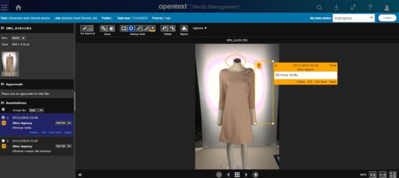
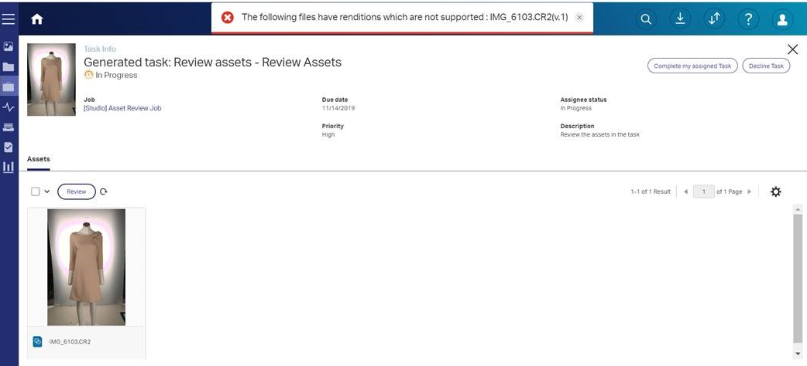
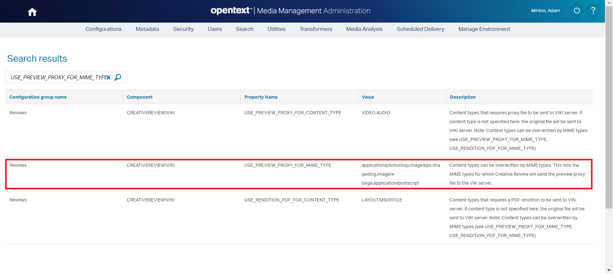
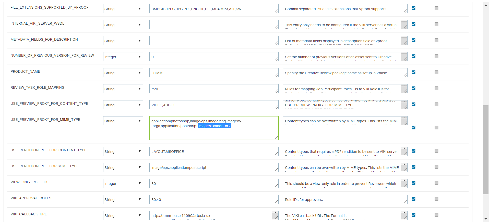
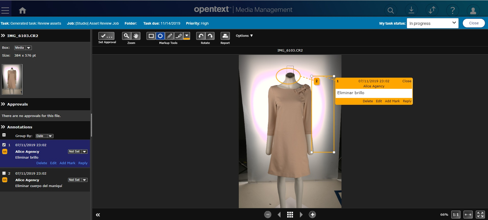

# Ficheros CR2 en Creative Review de OTMM

Has subido un fichero .CR2 (un formato de fichero RAW de Canon) a tu entorno de OpenText Media Management (OTMM). Ahora quieres utilizar Creative Review para que tu equipo realice la revión de la imagen, colaborando en tiempo real, donde cada uno pueda aportar sus comentarios… pero cuando lanzas la tarea de revisión te encuentras con un menaje similar a este:

The following files have renditions which are not supported : IMG_6103.CR2(v.1)

 

No hay problema, una pequeña modificación en la configuración y listo. Debemos seguir los siguientes pasos:

   - Acceder al panel de Adminitración de TEAMS: **[OTMM_HOME_URL]/teams**
   - Click sobre **Configurations > Settings**
   - Busca la propiedad **USE_PREVIEW_PROXY_FOR_MIME_TYPE**

 

   - Click sobre **«USE_PREVIEW_PROXY_FOR_MIME_TYPE«**
   - En la pantalla Component debemos buscar la propiedad **USE_PREVIEW_PROXY_FOR_MIME_TYPE**

 

   - Añadir «image/x-canon-cr2 » al valor de la propiedad. No debemos olvidar la coma para separar los valores
   - Por último debemos pulsar el botón **Save**

Ét voila! Ahora cuando accedemos a **Creative Review** vemos la previsualización del fichero CR2 sin problemas.

 

 