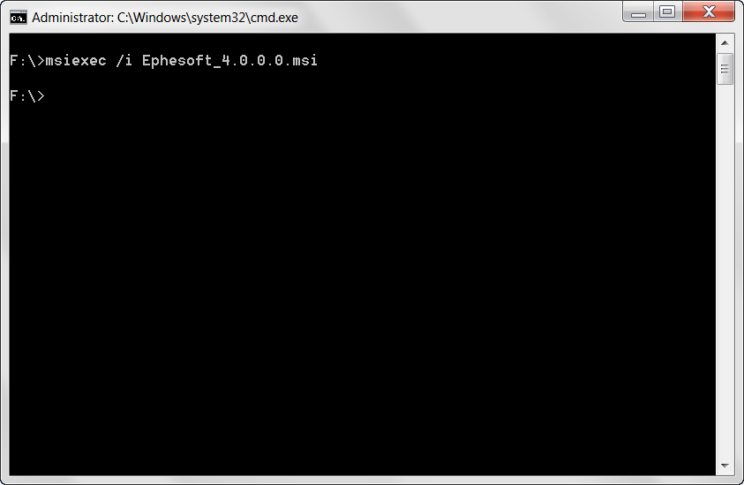
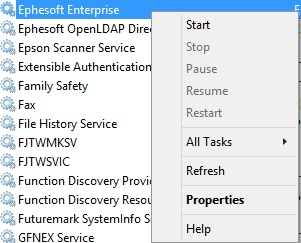

# Instalar Ephesoft en Windows

Ephesoft es un software de clasificación, extracción y captura inteligente de documentos. A pesar de que existe multiple documentación en su wiki, instalar Ephesoft en Windows puede suponer un reto. En este artículo se explica que tutoriales debes seguir y sobre todo en que orden realizar cada tarea para completar una instalación con exito.

## Pre-requisitos de Windows
En primer lugar debemos comprobar que nuestro sistema operativo cumple todos los pre-requisitos.

## Instalar Ephesoft en Windows
Los pasos a seguir para realizar una nueva instalación se detallan en el artículo Ephesoft: Fresh Installation Steps

Es especialmente importante no olvidar ejecutar el instalador como usuario Administrador.



Durante la instalación se nos dará la opción de elegir la base de datos a utilizar: Oracle, MariaDB o MS SQL Server.

Si elegimos MS SQL Server debemos tener en cuenta la política la política de password de SQL Server. La contraseña:

   * No puede contener el nombre de cuenta del usuario.
   * Debe tener al menos ocho caracteres de longitud.
   * Tiene que contener caracteres de tres de las siguientes cuatro categorías:
   * Letras mayúsculas latinas (de la A a la Z)
      * Letras latinas minúsculas (de la a a la z)
      * Dígitos  (0 a 9)
      * Caracteres no alfanuméricos como: signo de exclamación (!), Signo de dólar ($), signo de número (#) o porcentaje (%).

Las contraseñas pueden tener hasta 128 caracteres de largo. Debe usar contraseñas que sean lo más largas y complejas posible.

## Instalación de la licencia
Una vez completada la instalación debemos conseguir un fichero de licencia. Para ello debemos modificar el fichero [Ephesoft\Dependencies\licensing\]details.properties  según se indica en el tutorial Ephesoft License Installation, enviarlo a licensesARROBAephesoft.com.  Más tarde recibiremos un ficheo de licencia llamado ephesoft.lic que debermos copiar en Ephesoft\Dependencies\license-util\. A continuación debemos ejecutar el script install-license.bat dos veces como Administrador.

 
## Ejecutar Ephesoft como un servicio
Por último debemos hacer que Ephesoft se ejecute como un servicio de Windows. Personalmente prefiero hacer que sea un servicio de inicio automático.



## Acceder a Ephesoft en nuestro servidor
Una vez instalado e iniciado el servidor sólo tenemos que abrir un navegador e introducir esta dirección

http://localhost:8080/dcma/home.html


## Autenticación en Ephesoft
Al hacer click sobre cualquiera de las opciones de la página de inicio se nos mostrará una página de autenticación. Durante la instalación no hemos creado ningún usuario ni grupo, pero el instalador ha creado algunos usuarios y grupos. Podemos ver los usuarios predeterminados en el fichero {EPHESOFT_ROOT_DIR}\JavaAppServer\conf\tomcat-users.xml

```xml 
  <role rolename="admin"/>
  <role rolename="role1"/>
  <role rolename="role2"/>
  <role rolename="role3"/>
  <user username="ephesoft" password="demo" roles="admin"/>
  <user username="user1" password="user1" roles="role1"/>
  <user username="user2" password="user2" roles="role2"/>
  <user username="user3" password="user3" roles="role3"/>
```
 
Si necesitamos crear usuarios o grupos diferentes podemos hacerlo siguiendo el tutorial How to Administer Ephesoft Users & Groups

El proceso completo puede llevar unas 3 o 4 horas, debido al tiempo requerido para la instalación de todo el software y los diversos reinicios que requerirá Windows cada vez que instalamos o actualizamos algo.