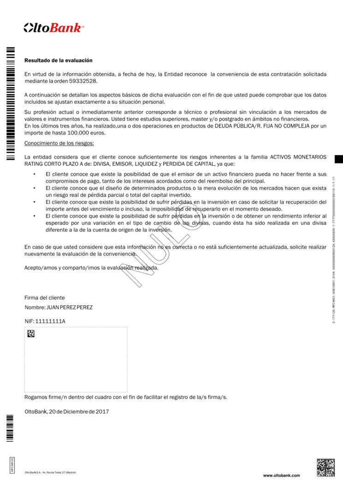
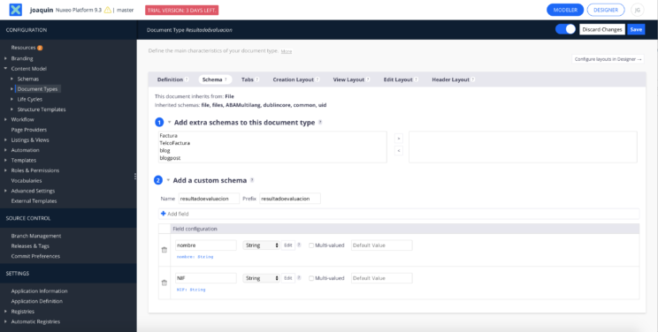
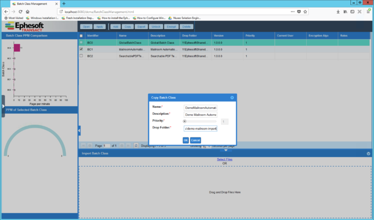
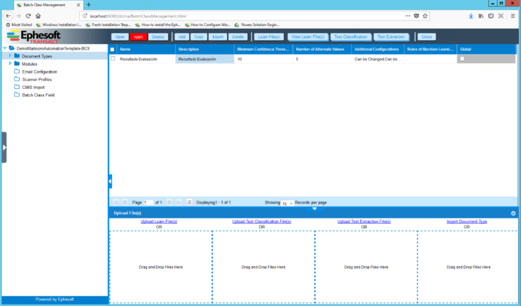
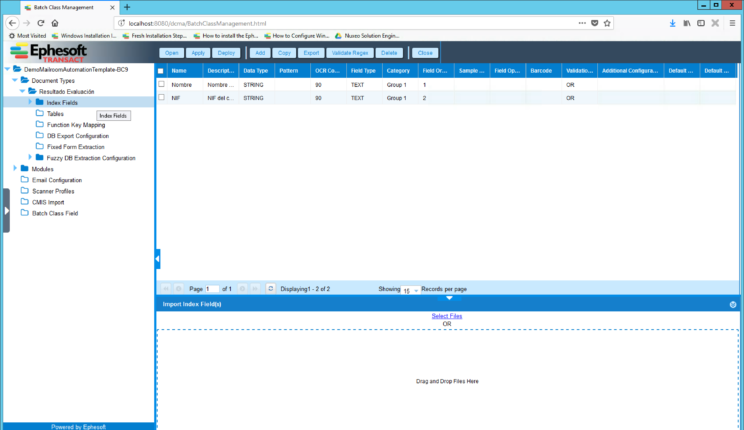
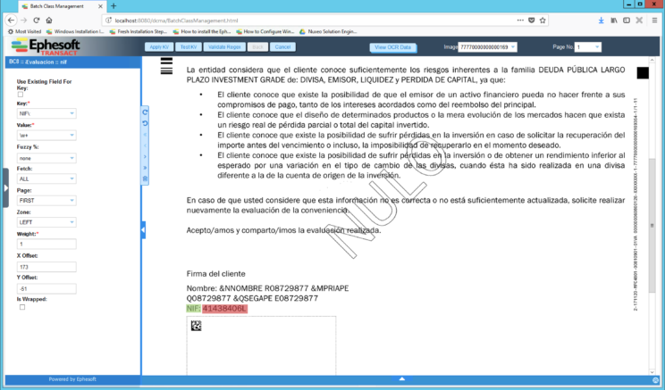

# Integración de Ephesoft y Nuxeo con CMIS

La captura de documentos  puede ser un factor importante en cualquier sistema que utilice un repositorio de contenido. En este artículo vamos a explicar como utilizar **Ephesoft** para **automatizar la captura de metadatos incluidos en los documentos** y como **almacenarlos** en nuestro respositorio de contenidos, **Nuxeo**. Para ello utilizaremos la integración **CMIS** de Epehesoft y Nuxeo.

Vamos procesar un documento denominado «Resultado de la evaluación», correspondiente a la evaluación de de conocimientos financieros que hace un banco antes de vender un producto financiero a uno de sus clientes. Extraeremos 2 datos, NIF y nombre del cliente.





## ¿Que es Nuxeo?
Nuxeo es una empresa de software que proporciona una plataforma de gestión de contenido para empresas que desarrollan su actividad en una  amplia gama de mercados verticales.

## ¿Que es Ephesoft?
Ephesoft es un software especializado en la «captura inteligente de documentos». Proporciona la capacidad de escanear documentos físicos y electrónicos, procesarlos automáticamente en busca de contenido arbitrario (ICR, OCR, imágenes, etc.) para exportar y/o informar sobre los resultados.

> Lectura recomendada: [Instalar Ephesoft en Windows](http://joaquinonsoft.com/instalar-ephesoft-windows)

## ¿Que es CMIS?
Servicios de interoperabilidad de administración de contenido (CMIs) es un estándar abierto que permite que diferentes repositorios de contenido interoperen. Específicamente, CMIs define una capa de abstracción para la administración de documentos mediante protocolos Web.

 

## Configuración de Nuxeo
La configuración de Nuxeo tan sólo requiere:

   - Definir un **nuevo tipo de documento personalizado** (ResultadoEvaluacion), que extenderá el tipo File y tendrá un esquema asociado (resultadoevaluacion) con los siguientes campos:
      - nombre (String)
      - NIF (String)
   - **Crear el directorio** en el que guardaremos los documentos procesados, e.g. **/DEMO/ordenenes**
   - **Dar de alta** un usuario con los permisos adecuados para poder escribir en la carpeta destino. En nuestro ejemplo usaremos el usuario **"ephesoft"**
 


 
## Configuración de Ephesoft
Para integrar Nuxeo y Ephesoft a través de CMIs debemos seguir los siguientes pasos:

### Crear una  clase batch
En primer lugar debemos crear una clase batch (batch class). La forma más rápida y sencilla de hacerlo es copiar una de las clases batch existentes. Para ello debemos:

   - Seleccionar la opción **Administrator > Batch Class Management** en la **pantalla de inicio**.
   - Introducir el **usurio y la contraseña la pantalla de login** (el usuario y password predeterminados son ephesoft/demo)
   - Hacer **clic** en la clase batch **BC1 (MailRoomAutomation)** de la lista
   - Pulsar el botón **Copy**
   - Introducir los siguientes en el **pop-up** Copy Batch Class:
      - **Name**:  Nombre de la clase batch
      - **Description**: Descripción de la clase batch
      - **Drop folder**: Nombre del directorio en que dejaremos los ficheros a procesar



 

### Definir un tipo de documento
Una vez creada la clase batch debemos definir un nuevo tipo de documento. Seleccionamos el nuevo tipo de documento y pulsamos el botón **Open**. A contiuanción debemos **seleccionar** la carpeta **Document Types** del menú lateral izquierdo. Por último pulsaremos el botón **Add** del menu superior e introduciremos los siguientes datos:

   - **Name**: ResultadoEvaluacion
   - **Description**: Resultado de la evaluación


Por último debemos pulsar sobre el botón **Apply**.

### Definir los campos índices
Tras crear un nuevo tipo de documento debemos definir  los campos que vamos a querer extraer del documento. Tan sólo debemos **seleccionar la carpeta Index fields** en el menú lateral izquierdo y  pulsar sobre el **botón Add** del menu superior. A continuación tenemos que facilitar los **valores de los campos Name, Description** y **Data Type**. En nuestro ejemplo:

   - **Nombre** (Nombre del cliente): STRING
   - **nif** (Número de identificación fiscal): STRING
 





## Definir los pares clave/valor para extracción de los campos
Para cada campo definido debemos seleccionar la carpeta **KV Extraction Rule** correspondiente en el menú lateral izquierdo, e.g. **Document types > ResultadoEvaluacion > Index Fields > nif > KV Extraction Rule**. A continuación pulsaremos sobre el botón **Add** del menú superior.

La pantalla KV Extraction Rule nos permite definir los criteros de extración de un campo determinado. En primer lugar debemos arrastrar y soltar un ejemplo del tipo documento que vamos a analizar (un pdf en nuestro caso). A continuación ajustar el rectangulo verde sobre la «clave», y el rectangulo rojo sobre el «valor» a extraer. Por último debemos especificar los parametros de captura:

   - **Key**: NIF\:
   - **Value**: \w+
   - **Fetch**: ALL
   - **Page**: FIRST
   - **Zone**: LEFT




> Como valores para los campos «key» y «value» se estan utilizando expresiones regulares.

### Exportar documentos con CMIS
Una vez procesados los documentos se exportarán a Nuxeo utilizando el CMIS. Para ello debemos acceder al menú **Modules > Export > CMIS_EXPORT** e introducir los siguientes parámetros:

   - **CMIS Root Folder Name**: Nombre del directorio que hemos creado en Nuxeo para almacenar los documentos. El path es relativo al repositorio de Nuxeo que utlicemos para alojar los documentos y no debe contener «/» al principio ni al final del path.
   - **CMIS Upload File Extension** – Extensión de los ficheros que se subiran a Nuxeo. Podemos elegir entre “pdf” y “tiff”.
   - **CMIS Server URL** – URL del servidor de Nuxeo. La URL sigue este patrón “http://SERVER:PORT/nuxeo/atom/cmis”.
   - **CMIS Server User Name** – Usuario de Nuxeo que tieme permiso de escritura en el directorio especificado en  “Cmis Root Folder Name”.
   - **CMIS Server User Password**: Contraseña del usuario de Nuxeo.
   - **CMIS Server Repository Id**: Nombre del repositorio de Nuxeo que vamos a emplear. El repositorio predeterminado se llama “default”.
   - **CMIS Server Switch ON/OFF**: Debemos asegurarnos de que su valor es "ON"
   


 

### Configurar la correspondencia de campos
Por último debemos acceder al directorio **«EPHESOFT_HOME\SharedFolders\BC9\cmis-plugin-mapping\DLF-Attribute-mapping.properties»** y definir la correspondencia entre los campos de los tipos de datos definidos en Ephesoft y en Nuxeo

> El directorio de instalación puede variar, así como el nombre del la clase batch (BC9 en el ejemplo)

```shell 
ResultadoEvaluacion=ResultadoEvaluacion
ResultadoEvaluacion.nombre=resultadoevaluacion:nombre
ResultadoEvaluacion.nif=resultadoevaluacion:nif
```

En la parte izquiera aparece la información de los tipos de documentos y campos definitos en Ephesoft (separados por «.») y en la parte derecha aparecen los documentos definidos en Nuxeo, con los nombres de campos separados por «:»

## ¡A ejecutar!
Si hemos seguido todos los pasos ya sólo tenemos que arrastrar y soltar un documento en la carpeta que utilizamos en el campo **«Drop folder»** cuando creamos nuestra clase batch. Se procesará automáticamente por Ephesoft y se creará en Nuxeo con sus metadatos asociados.