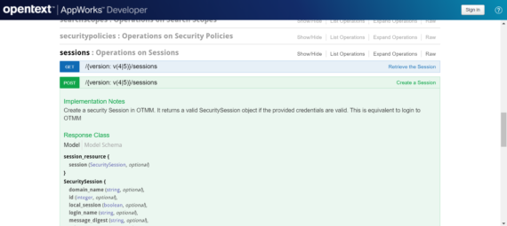
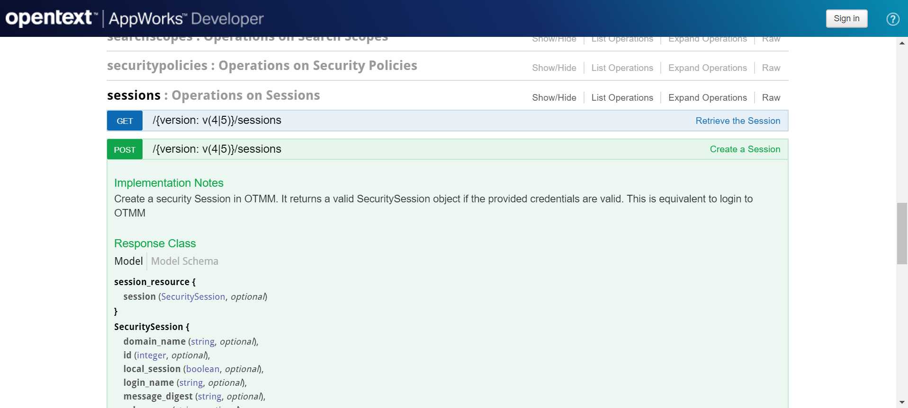
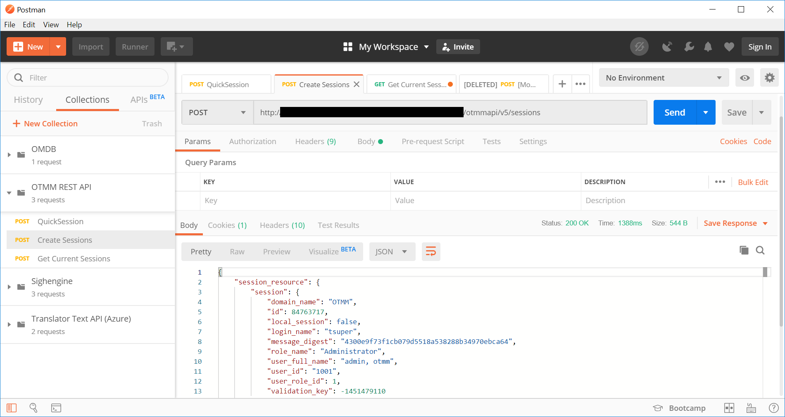
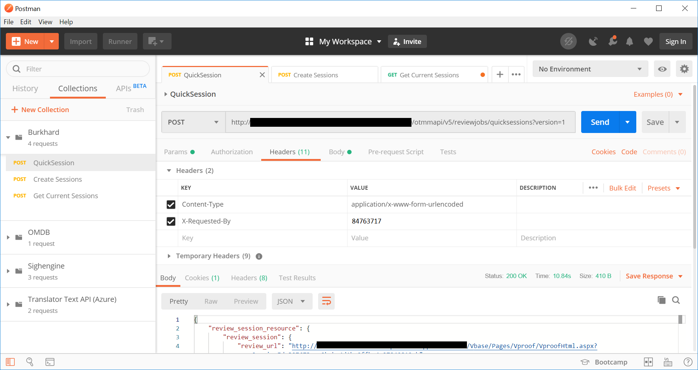

# Invocación del API REST de OTMM



[OpenText Media Management proporciona un API REST](https://developer.opentext.com/webaccess/#url=%2Fawd%2Fresources%2Fapis%2Fmedia-manager-v5&tab=501)  que permite realizar las operaciones más habituales de la plataforma, como crear un asset, realizar una búsqueda, modificar un permiso, etc. En este artículo explicaremos como realizar una invocación del API REST de OTMM.

## Crear una sesión
En primer lugar debemos crear un sesión, para ello debemos invocar al método

```
POST /{version: v(4|5)}/sessions
```

Este métdo crea una sesión de seguridad en OTMM. Devuelve un objeto SecuritySession válido si las credenciales proporcionadas son correctas. Esto es equivalente a iniciar sesión en OTMM



Utilizando Postman debemos crear una nueva petición con los siguientes datos:

   - **Método**: POST
   - **URL**: <URL_OTMM>/otmmapi/v5/sessions
   - **Headers**:
      - **Content-Type**: application/x-www-form-urlencoded
   - **Body**:
      - **x-www-form-urlencoded**
      - **username**: tsuper
      - **password**: <MY_ULTRA_SECRET_PASSWORD>



Tras introducir todos los datos y pulsar sobre el botón *'Send'* obtendremos una respuesta similar a esta:

```JavaScript
{
    "session_resource": {
        "session": {
            "domain_name": "OTMM",
            "id": 84763717,
            "local_session": false,
            "login_name": "tsuper",
            "message_digest": "4300e9f73f1cb079d5518a538288b34970ebca64",
            "role_name": "Administrator",
            "user_full_name": "admin, otmm",
            "user_id": "1001",
            "user_role_id": 1,
            "validation_key": -1451479110
        }
    }
}
```

La parte que nos interesa de la respuesta es el campo **'id'**, que nos servirá para identificar la sessión y realizar nuevas llamadas a métodos del API.

## Pre-requisitos para invocar a un método del API REST de OTMM
A excepción de los métodos  relativos a ‘sessions’, cualquier llamada a un método del API REST de OTMM debe incluir el id de session en la cabecera ‘X-Requested-By’. En nuestro ejemplo:

```
X-Requested-By: 84763717 (El valor devuelto por el método ‘Create session’)
```

## Invocando al método /version: v5}/reviewjobs/quicksessions

Para continuar con el ejemplo vamos a invocar al método

```
POST /{version: v(4|5)}/reviewjobs/quicksessions
```

Este método crea una sesión de revisión rápida de Creative Review/Viki, que permita ver los activos en Viki fuera del contexto de una tarea. La respuesta consta de una URL y un identificador de sesión que se puede utilizar para iniciar la sesión de revisión rápida.

Estos son los datos que debemos introducir en Postman para crear la nueva invocación:

   - **Método**: POST
   - **URL**: <URL_OTMM>/otmmapi/v5/reviewjobs/quicksessions?version=1
   - **Params**:
      - **version**: 1
   - **Headers**:
      - **X-Requested-By**: 84763717 `(El valor devuelto en el campo 'id' por Create Session)`
   - **Body**:
      - **x-www-form-urlencoded** (seleccionar)
      - **asset_ids**: acad2d2463740fdcfb58a2b8fe1cbbe306d629b2 `(Identificador de un asset existente en nuestra instancia de OTMM)`




Y listo, hemos hecho una llamada al API REST de OTMM con exito.

 
