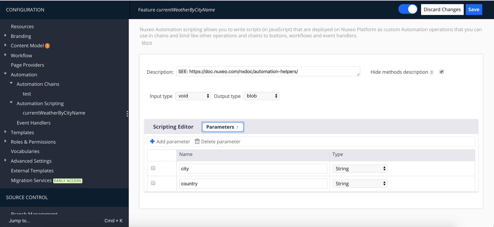
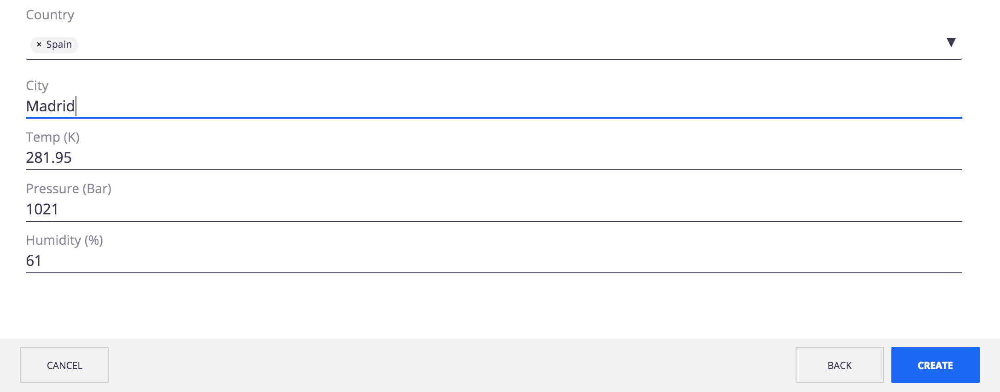

# Llamar a un API REST desde un automation script en Nuxeo


En ocasiones necesitamos llamar a un API REST desde Nuxeo. Podemos hacerlo de diversas formas, la primera opción consiste en [crear un add-on en Java](https://doc.nuxeo.com/nxdoc/develop-with-nuxeo-platform/) que encapsule la llamada, esto es especialmente interesante si podemos reutilizar el add-on en varios proyectos. La segunda consiste en encapsular la llamada al API REST desde un automation script. En este artículo veremos como llamar a un **API REST** desde un **Automation Script** en Nuxeo.

 
En este ejemplo vamos a usar el API REST de [Open Weather Map](https://openweathermap.org/current) para recuperar información meteorológica a partir del nombre de una ciudad:

> **By city name**
> **Description**: You can call by city name or city name and country code. API responds with a list of results that match a searching word.
>
> **API call**: 
> api.openweathermap.org/data/2.5/weather?q={city name}&appid={id}
>
> api.openweathermap.org/data/2.5/weather?q={city name},{country code}&appid={id}
>
> **Parameters**:
> **q** city name and country code divided by comma, use ISO 3166 country codes
> **id** API key

## Creando el automation script

### Definición de parámetros del automation script
 

Desde la opción **CONFIGURATION > Automation > Automation scripting** de Nuxeo Studio crearemos un nuevo automation script llamado **currentWeatherByCityName**.

A continuación vamos a definir los parámetros de entrada de nuestro automation script: city (obligatorio) y country (opcional).



Además  debemos definir los tipos de datos que vamos  a usar como entrada (void, ya que no necesitamos ningún documento/s o blob/s) y como salidad (blob, porque queremos devolver un cadena JSON con la información meteorológica).

### Leer propiedades desde nuxeo.conf
Aún necesitamos un parámetro adicional para realizar la llamada, el API Key. Como se trata de una información «secreta» no vamos a escribirlo «a fuego» en nuestro código y tampoco lo vamos a solicitar como parámetro de entrada de nuestro automation script. En lugar de esto vamos a crear una nueva propiedad en el fichero **nuxeo.conf** que luego recuperaremos desde el script.

```shell
##=============================================================================
## Open Weather Map
##=============================================================================
openweathermap.appid=<MY_API_KEY>

##=============================================================================
## Nuxeo configuration file
##=============================================================================
## See https://doc.nuxeo.com/nxdoc/configuration-parameters-index-nuxeoconf/
## for detailed information about the settings below.

...
```

Nuxeo proporciona el objeto **Env** con el que podemos recuperar el valor de las propiedades definidas en el fichero de configuración **nuxeo.conf**:

```shell
currentWeatherByCityName
var key = Env['openweathermap.appid'];
```

### Invocación a un API REST desde un automation script

Para la invocación al API REST utilizaremos el **objeto HTTP**:

```javascript
var resultBlob = HTTP.call(user, pass, method, url);

var resultBlob = HTTP.call(user, pass, method, url, data, headers);
```

Donde:

   - **user**: Usuario
   - **pass**: Contraseña
   - **method**: POST, GET, PUT, PATCH, DELETE.
   - **data**: Stringify JSON con los parámetros de la query.
   - **headers**: Array con las cabeceras http necesarias para la llamada.
 

### Devolviendo una cadena JSON
La llamada a **HTTP.call** devuelve objeto JSONBlob, pero nosotros queremos devolver una cadena que representa el JSON que hemos recuperado. No hay problema, tan sólo tenemos que llamar al método **getString()** en el objeto devuelto por la llamada a **HTTP.call**

```javascript
currentWeatherByCityName
weather = HTTP.call(null, null, 'GET', url);

...

return weather.getString() ;
``` 

### Código fuente del automation script completo

Este sería el aspecto final de nuestro automation script:

```javascript
currentWeatherByCityName
JavaScript
function run(input, params) {

  var weather = null;
  
  var city = params.city;
  
  if(city){
    var key = Env['openweathermap.appid'];
    
    if(key) {
      var url = 'http://api.openweathermap.org/data/2.5/weather?q='  + city;
      if(params.country){
        url += ',' + params.country;
      }
      url += '&appid='+key;      
      Console.log("URL: " + url);      
            
      weather = HTTP.call(null, null, 'GET', url, null, null);
      weather = weather.getString();

      Console.log("weather: " + weather);      
    }
    else {
      Console.info("Please, set openweathermap.appid property at nuxeo.conf");
    }

  }
  else{
          Console.info("City parameter is mandatory");
  }

  return weather;
}
```

### Invocando un automation script desde Web UI

Ya hemos invocado el API REST desde un automation script. ¿Como puedo utlizar este automation script en Web UI? Tan solo tenemos que utlizar el web element nuxeo-operation para invocar nuestra operación:

```html 
<nuxeo-operation auto
                 op="javascript.currentWeatherByCityName"
                 params='{"city": "Madrid"}'
                 on-response="_onWeatherChange">
</nuxeo-operation>
``` 

Cuando la operación se ejecute el navegador llamará al método **_onWeatherChange** con la respuesta. Esta es una posible implementación en la que recuperamos algunos valores de temperatura, presión y humedad:

```html 
    _onWeatherChange: function(response){
      console.log(response);
      
      if(response.detail.response.value){
        var value = response.detail.response.value;
				if(value != "Not Found"){
          var weather = JSON.parse(response.detail.response.value);
          this.temp = weather.main.temp; 
          this.pressure = weather.main.pressure;
          this.humidity = weather.main.humidity;                  
        }                    
      }
    }
```

Este sería el código completo del nuevo web element:

```html
<!--
`nuxeo-geofile-create-layout`
@group Nuxeo UI
@element nuxeo-geofile-create-layout
-->
<dom-module id="nuxeo-geofile-create-layout">
  <template>
    <style>
      *[role=widget] {
        padding: 5px;
      }
    </style>
    
		<nuxeo-operation auto
                 op="javascript.currentWeatherByCityName"
                 params='{"city": "[[city]]"}'
                 on-response="_onWeatherChange">
    </nuxeo-operation>
    
    
    <nuxeo-input role="widget" value="{{document.properties.dc:title}}" label="Title" type="text"></nuxeo-input>

    <nuxeo-directory-suggestion role="widget" value="{{document.properties.geo:country}}" label="Country" directory-name="country" params="{&quot;filters&quot; : &quot;parent=europe&quot;}" min-chars="0">
    </nuxeo-directory-suggestion>
    
    <nuxeo-input role="widget" value="{{city}}" label="City" type="text"></nuxeo-input>    

    <nuxeo-input role="widget" value="{{temp}}" label="Temp (K)" type="text"></nuxeo-input>    
    <nuxeo-input role="widget" value="{{pressure}}" label="Pressure (Bar)" type="text"></nuxeo-input>    
    <nuxeo-input role="widget" value="{{humidity}}" label="Humidity (%)" type="text"></nuxeo-input>        
    
  </template>

  <script>
  Polymer({
    is: 'nuxeo-geofile-create-layout',
    behaviors: [Nuxeo.LayoutBehavior],
    properties: {

      /**
         * @doctype GeoFile
         */
      document: {
        type: Object,
      },

    },
    
    _onWeatherChange: function(response){
      console.log(response);
      
      if(response.detail.response.value){
        var value = response.detail.response.value;
				if(value != "Not Found"){
          var weather = JSON.parse(response.detail.response.value);
          this.temp = weather.main.temp; 
          this.pressure = weather.main.pressure;
          this.humidity = weather.main.humidity;                  
        }                    
      }
    }
  });
  </script>
</dom-module>
```

Una vez desplegados nuestros cambios el formulatio de creación de nuestro documento tendría este aspecto:


