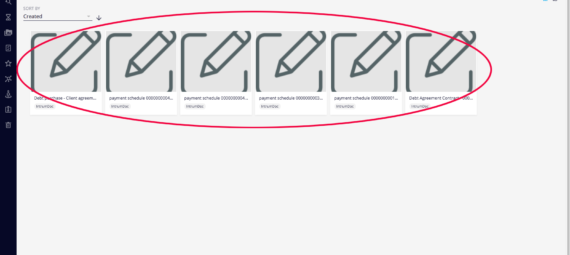
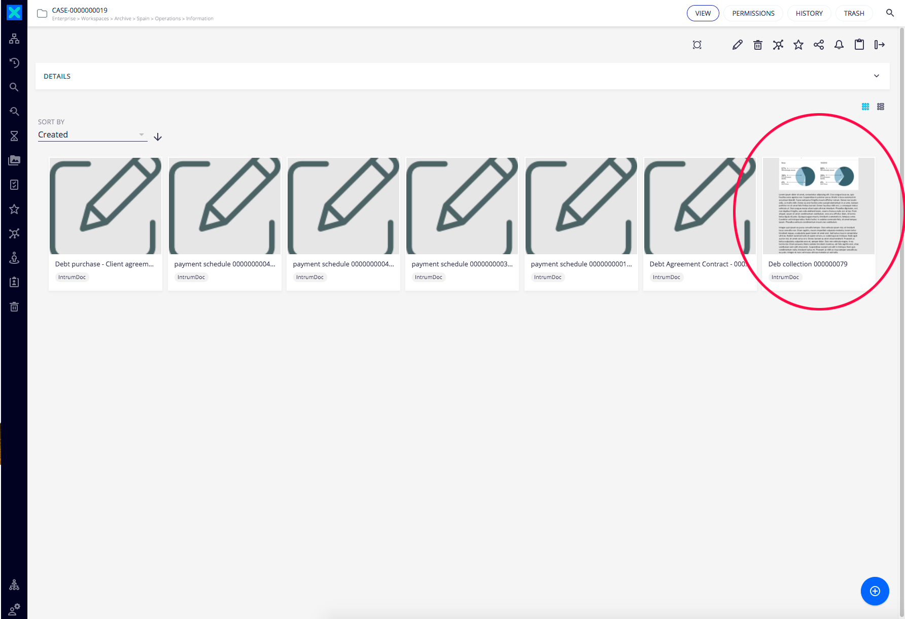

# Nuxeo no genera la vista previa



Has instalado **Nuxeo** y acabas de crear tu primer documento, pero te das cuenta de que el sistema **no ha generado la vista previa**. ¿Que ha ocurrido? La última versión de ImageMagick ha modificado las politicas por defecto para la generación de ficheros PDFs, lo que afecta a la generación de vistas previas de documentos en Nuxeo.En este artículo te explico como solucionarlo.

Un vistazo rápido al fichero de log (**server.log**) nos puede dar una pista:

```
2018-10-19 09:14:38,752 WARN  [Nuxeo-Work-default-1:931009180838564.233460892] [org.nuxeo.ecm.platform.thumbnail.factories.ThumbnailDocumentFactory] Cannot compute document thumbnail
org.nuxeo.ecm.core.convert.api.ConversionException: Thumbnail conversion failed
	at org.nuxeo.ecm.platform.thumbnail.converter.ThumbnailDocumentConverter.convert(ThumbnailDocumentConverter.java:92)
	at org.nuxeo.ecm.core.convert.extension.ChainedConverter.convertBasedSubConverters(ChainedConverter.java:87)
	at org.nuxeo.ecm.core.convert.extension.ChainedConverter.convert(ChainedConverter.java:71)
	at org.nuxeo.ecm.core.convert.service.ConversionServiceImpl.convert(ConversionServiceImpl.java:321)
	at org.nuxeo.ecm.platform.thumbnail.converter.AnyToThumbnailConverter.convert(AnyToThumbnailConverter.java:77)
	at org.nuxeo.ecm.core.convert.service.ConversionServiceImpl.convert(ConversionServiceImpl.java:321)
	at org.nuxeo.ecm.platform.thumbnail.factories.ThumbnailDocumentFactory.computeThumbnail(ThumbnailDocumentFactory.java:92)
	at org.nuxeo.ecm.core.api.thumbnail.ThumbnailServiceImpl.computeThumbnail(ThumbnailServiceImpl.java:99)
	at org.nuxeo.ecm.core.api.thumbnail.ThumbnailAdapter.computeThumbnail(ThumbnailAdapter.java:58)
	at org.nuxeo.ecm.platform.thumbnail.listener.UpdateThumbnailListener.processDoc(UpdateThumbnailListener.java:67)
	at org.nuxeo.ecm.platform.thumbnail.listener.UpdateThumbnailListener.handleEvent(UpdateThumbnailListener.java:137)
	at org.nuxeo.ecm.core.event.impl.AsyncEventExecutor$ListenerWork.work(AsyncEventExecutor.java:221)
	at org.nuxeo.ecm.core.work.AbstractWork.runWorkWithTransaction(AbstractWork.java:436)
	at org.nuxeo.ecm.core.work.AbstractWork.run(AbstractWork.java:356)
	at org.nuxeo.ecm.core.work.WorkHolder.run(WorkHolder.java:57)
	at java.util.concurrent.ThreadPoolExecutor.runWorker(ThreadPoolExecutor.java:1149)
	at java.util.concurrent.ThreadPoolExecutor$Worker.run(ThreadPoolExecutor.java:624)
	at java.lang.Thread.run(Thread.java:748)
Caused by: org.nuxeo.ecm.platform.commandline.executor.api.CommandException: Error code 1 return by command: convert -define registry:temporary-path=#{nuxeo.tmp.dir} -quiet -strip -thumbnail #{size} -background transparent -gravity center -format png -quality 75 #{inputFilePath}[0] #{outputFilePath}
convert: not authorized `/mnt/nuxeo-temp/7767336542145330687/nxblob-2878083751313857955.pdf' @ error/constitute.c/ReadImage/412.
  convert: no images defined `/mnt/nuxeo-temp/nxblob-5647652445679633778.png' @ error/convert.c/ConvertImageCommand/3210.
	at org.nuxeo.ecm.platform.commandline.executor.api.ExecResult.<init>(ExecResult.java:62)
	at org.nuxeo.ecm.platform.commandline.executor.service.executors.ShellExecutor.exec(ShellExecutor.java:82)
	at org.nuxeo.ecm.platform.commandline.executor.service.CommandLineExecutorComponent.execCommand(CommandLineExecutorComponent.java:173)
	at org.nuxeo.ecm.platform.thumbnail.converter.ThumbnailDocumentConverter.convert(ThumbnailDocumentConverter.java:85)
	... 17 more
```

Si encontramos el mensaje:

> convert: not authorized …

significa que **ImageMagick** no tiene permisos para convertir el documento en un PDF (utilizado por Nuxeo para generar la vista previa de cada documento). Esto es así debido a que existe una vulnerabilidad en versiones de Ghostscript anteriores a las 9.25.

Podemos comprobar la versión de ghostscript que tenemos instalada ejecutando este comando:

```shell
$ dpkg --list | grep ghostscript
ii  ghostscript                           9.10~dfsg-0ubuntu10.9                      amd64        interpreter for the PostScript language and for PDF
```

Si es anterior a la versión 9.25 como en nuestro ejemplo, debemos actualizar nuestra versión:

```shell
$ sudo apt-get update
$ sudo apt-get install ghostscript
```

Tras la actualización de nuestra sistema deberíamos tener la última versión instalada:

```shell
$ dpkg --list | grep ghostscript
ii  ghostscript                           9.25~dfsg+1-0ubuntu0.14.04.1               amd64        interpreter for the PostScript language and for PDF
```

A continuación debemos acceder al directorio de instalación de ImageMagick. En mi caso /etc/ImageMagick-6  y editar el fichero policy.xml con nuestro editor preferido:

```xml
<policymap>
  ...
  <!-- Line modified (NXP-25914) -->
  <!--<policy domain="coder" rights="none" pattern="PDF" />-->
  <policy domain="coder" rights="read|write" pattern="PDF" />
  ...
</policymap>
```

Debemos asegurarnos de tener permiso de lectura/escritura en el patrón PDF.

Si hemos seguido los pasos la próxima vez que creemos un nuevo documento se generará la vista previa automáticamente.


 

 

 

 

 