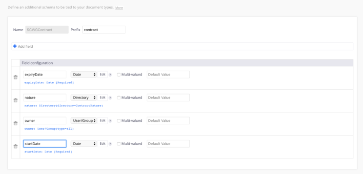

# Nuxeo: Soporte multiidioma en vocabularios


Web UI, la interface de usuario de Nuxeo, ofrece soporte para la internalización de los diferentes web elements que la componen. Sin embargo el soporte multiidioma de los vocabularios se gestiona de forma direferente. En este artículo vamos a explicar los pasos a seguir para poder dotar de soporte multiidioma a nuestros vocabularios.

## Definición de un vocabulario
Un vocabulario no es más que una lista de etiquetas que se usa en la aplicación. En primer lugar debemos definir el vocabulario desde la opción **CONFIGURATION > Vocabularies** de Nuxeo Studio. En nuestro ejemplo definiremos un vocabulario denominado contractNature con dos entradas

   - **id**: mnda – **label**: label.directories.ContractNature.mnda
   - **id**: partner – **label**: label.directories.ContractNature.msa


 
## Definición de un esquema
A continuación vamos a definir un esquema (una colección de metadatos) que asociaremos a un tipo de documento.  El esquema, denominado contract, consta de 4 campos:

   - **expiryDate**: (Date) fecha de expiración del contrato
   - **nature**: (Directoy) tipo de contrato
   - **owner**: (User/Group) Usuario responsable del contrato
   - **startDate**: Fecha de inicio de vigencia del contrato

El campo que nos interesa es nature, que hemos definido como tipo Directory, es decir, un vocabulario. En concreto un vocabulario de tipo contractNature.


 

## Recursos i18n para la traducción de un vocabulario
El siguiente paso consiste en crear un **fichero properties** con los nombres de las etiquestas de nuestro vocabulario y sus traducciones. El fichero para el idioma predeterminado es **messages.properties**. En nuestro ejemplo el idioma predeterminado es el ingles y el fichero messages.properties tendría este aspecto:

```shell
label.directories.ContractNature.mnda=Mutual Non-Disclosure Agreement
label.directories.ContractNature.msa=Master Services Agreement
```

Podemos crear traducciones para tantos idiomas como sea necesario. Los ficheros para las traducciones a idiomas adicionales deben seguir este patrón **messages_[lang]_[country].properties**, donde *[lang]* es el código ISO del idioma y *[country]* es el código ISO del país. Por ejemplo si queremos añadir traducciones en español debemos crear el fichero **messages_es_ES.properties**

```shell
label.directories.ContractNature.mnda=Acuerdo mutuo de no divulgación
label.directories.ContractNature.msa=Acuerdo marco de servicios
```

Una vez creados estos ficheros debemos subirlos a Studio desde la opcion i18n Files accesible desde el menu CONFIGURATION > Resources


Una vez subidos los ficheros de propiedades podremos editarlos desde Nuxeo Studio.


Y Voilà, ya tenemos todos los ingredientes que necesitamos para traducir a múltiples idiomas nuestro vocabulario


