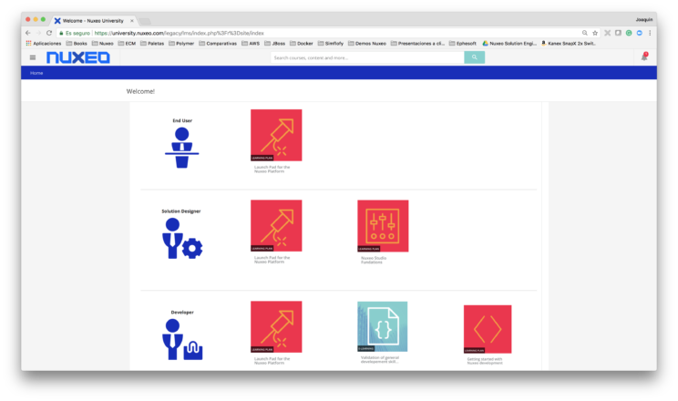

# Nuxeo University: Planes de formación

**Nuxeo University** es la plataforma de **formación en línea** desarrollada por Nuxeo. Permite explorar la amplia gama de recursos disponibles, inscribirse en diferentes cursos, validar los módulos  mediante cuestionarios en línea, enviar código para su evaluación, seguir nuestro progreso y  ¡conseguir nuestra certificación!

## Formación guiada para simplificar el camino
Si eres nuevo en Nuxeo, lo más recomendable es seguir los **planes de formación**. Están diseñados para proporcionar cursos en orden secuencial y lógico para que:

   * No tengtas que preocuparte por los requisitos previos
   * Se mezcle teoría y ejercicios prácticos
   * Se organizan por dificultad y área de aprendizaje
   * Son un punto de partida ideal para ingresar al programa de certificación

En cualquier caso, el primer paso es alcanzar una comprensión funcional clara de la plataforma Nuxeo. Conseguiremos este objetivo compeltando  el Plan de aprendizaje de **Nuxeo Fundamentals**. En la web de Nuxeo University se muestra esta tabla, que presenta el plan de aprendizaje que debemos tomar según nuestro perfil:

   * **Usuario final**:
      * Launch Pad for the Nuxeo Platform
   * **Ingeniero de Soluciones**:
      * Launch Pad for the Nuxeo Platform
      * Nuxeo Studio Fundations
   * **Desarrollador**:
      * Launch Pad for the Nuxeo Platform
      * Validation of general development skills
      * Getting started with Nuxeo Development
	  

 

## Launch Pad for the Nuxeo Platform Discovery
Este plan de formación es el obligado primer paso para cada nuevo usuario de Nuxeo. Proporciona una comprensión funcional de la plataforma Nuxeo, con el fin de adquirir las habilidades fundamentales.

Nos guiará a través de todos los cursos necesarios para tomar la certificación de fundamentos de Nuxeo. Explica:

   * Cómo trabajar con Nuxeo Web UI, desde una perspectiva de usuario final
   * La arquitectura general de la plataforma Nuxeo
   * Cómo utilizar Nuxeo como plataforma de gestión de activos digitales (Digital Assets Management, DAM)
   * Una introducción de Nuxeo Studio con todos sus elementos de configuración
 

## Nuxeo Studio Foundations
Si necesitas personalizar la plataforma con Nuxeo Studio, entonces este plan de formación es exactamente lo que estás buscando. Ofrece una visión general de la característica principal de **Nuxeo Studio Modeler** y **Nuxeo Studio Designer**.

Nos guiará a través de todos los cursos necesarios para tomar la **certificación avanzada de Nuxeo Studio**.

Es muy aconsejable completar el plan de formación **Launch Pad for the Nuxeo Platform** antes de comenzar.

 

## Getting started with Nuxeo development
Este plan de formación es ideal para cualquier desarrollador que necesite crear un paquete Nuxeo con su lógica de negocios personalizada o para personalizar la interface de usuario gracias a Nuxeo Elements.

Nos proporcionará los conocimientos básicos para preparar la **certificación básica de backend de Nuxeo**, así como la **certificación básica de frontend Nuxeo**.

Es muy aconsejable completar los planes de formación **Launch Pad for the Nuxeo Platform** y **Nuxeo Studio Foundations** antes de comenzar.

 