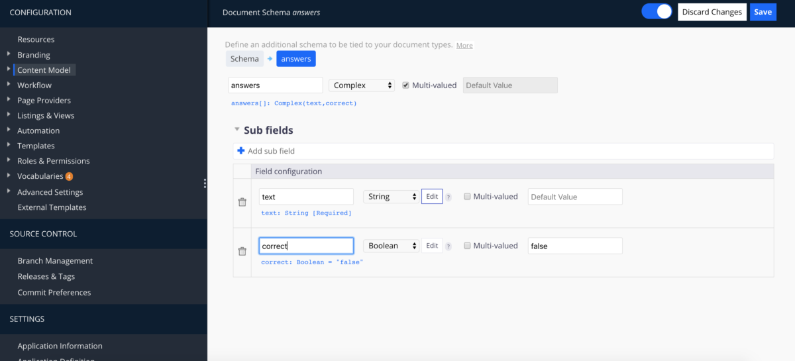
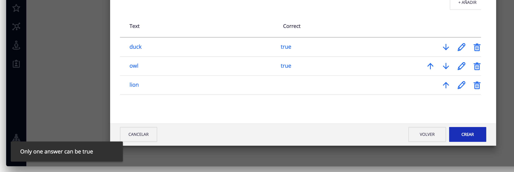

# Validación personalizada de formularios en WebUI (Nuxeo)

")


Web UI, la interface web de Nuxeo, realiza validaciones automáticas en los formularios de creación, edición, importación de un tipo de documento en función de los atributos de los diferentes campos del formulario (obligatoriedad, tipo de dato…). Sin embargo en ocasiones necesitamos realizar una validación personalizada en un formularios en Web UI. Para ello tan sólo hemos de implementar un método validate en nuestro web element. La función debe devolver un valor true si se supera la validación y false en caso contrario.

```javascript
validate: function() {

 if(...) {

   // Validate function expects us to return a boolean
   // Used to tell if the form should be submitted
   return false;
 }

 return true;
}
```

Veamos un ejemplo con un caso real. Supongamos que tenemos un tipo de documento que representa un ejercicio de tipo test, con un enunciado y un varias respuestas de las que sólo una de ellas puede ser verdadera.




## Nuxeo custom schema

Esta sería la implementación de nuestro método validate, en el que se comprueba que sólo exista una respuesta valida  entre las añadidas como posibles respuestas:

```html 
<!--
`one-valid-answer-exercise-edit-layout`
@group Nuxeo UI
@element one-valid-answer-exercise-edit-layout
-->
<dom-module id="one-valid-answer-exercise-edit-layout">
  <template>
    <style>
      *[role=widget] {
        padding: 5px;
      }
    </style>

    <nuxeo-input role="widget" value="{{document.properties.dc:title}}" label="[[i18n('label.form.title')]]" type="text"></nuxeo-input>

    <nuxeo-data-table role="widget" items="{{document.properties.answers:answers}}" orderable="true" editable="true">
      <nuxeo-data-table-column name="[[i18n('label.form.text')]]">
        <template>
          [[item.text]]
        </template>
      </nuxeo-data-table-column>

      <nuxeo-data-table-column name="[[i18n('label.form.correct')]]">
        <template>
          [[item.correct]]
        </template>
      </nuxeo-data-table-column>

      <nuxeo-data-table-form>
        <template>
          <nuxeo-input value="{{item.text}}" label="Text" type="text"></nuxeo-input>
          <paper-checkbox checked="{{item.correct}}"></paper-checkbox>
        </template>
      </nuxeo-data-table-form>
    </nuxeo-data-table>

    <nuxeo-directory-suggestion role="widget" value="{{document.properties.pattern:type}}" label="[[i18n('label.form.type')]]" required="true" directory-name="PatternType" min-chars="0" readonly></nuxeo-directory-suggestion>


  </template>

  <script>
    Polymer({
      is: 'one-valid-answer-exercise-edit-layout',
      behaviors: [Nuxeo.LayoutBehavior],
      properties: {
        

        //You can use either @schema or @doctype annotation in your model
        /**
         * @schema dublincore
         */
        document: {
          type: Object
        }
      },
      
      validate: function() {
        var answers = this.get('document.properties.answers:answers');
      	if(!answers || answers.length <= 0) {
          this.fire('notify', {"message": this.i18n('Provide at least 1 answer')});
          
          return false;
        }
        
        var nAnswers = answers.length;
        var nTrueAnswers = 0;
        for(i = 0; i<nAnswers; i++){
          if(answers[i].correct == "true") {
            nTrueAnswers++;
          }                  
        }
        
        if(nTrueAnswers != 1){
          this.fire('notify', {"message": this.i18n('Only one answer can be true')});
          return false;
        }
        
        return true;
    	}

    });
  </script>
</dom-module>
```

Si intentamos crear un ejercicio con más de una respuesta correcta al pulsar sobre el botón CREAR el sistema mostrará un mensaje de error y no nos permitirá crear el ejercicio.



